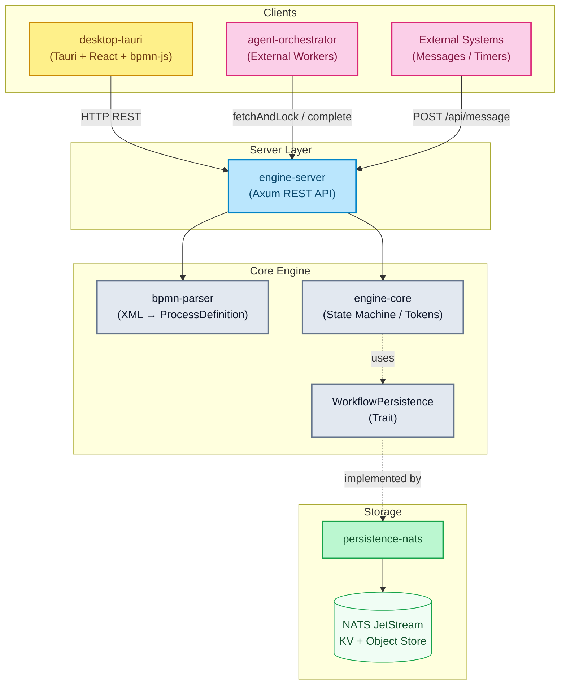

# BPMNinja

[](https://www.rust-lang.org/)
[](.github/workflows/ci.yml)
[](https://github.com/maatini/bpmninja/actions/workflows/mutation-tests.yml)
[](#license)

<div align="center">
  
</div>

**A BPMN 2.0 workflow engine written in Rust** — token-based execution, NATS persistence, REST API and desktop UI.

---

## Table of Contents

- [Overview](#overview)
- [Crates (Modules)](#crates-modules)
- [Workspace Scope](#workspace-scope)
- [Supported BPMN Elements](#supported-bpmn-elements)
- [Architecture](#architecture)
- [Quick Start](#quick-start)
- [REST API](#rest-api)
- [External Task Client (TypeScript)](#external-task-client-typescript)
- [Desktop Application (UI)](#desktop-application-ui)
- [Docker Compose](#docker-compose)
- [Test Metrics](#test-metrics)
- [Roadmap](#roadmap)
- [License](#license)

---

## Overview

bpmninja is a BPMN 2.0 engine with the following core features:

- **Token-based execution** — each path is tracked as an independent token
- **29 BPMN elements** — start/end events, user/service/script tasks, gateways (XOR, AND, OR, complex, event-based), timers, messages, boundary events (timer, message, error, escalation, compensation), call activities, sub-processes
- **Full ISO 8601 timers** — Duration (`PT30S`), AbsoluteDate (`2026-04-06T14:30:00Z`), Cron (`0 9 * * MON-FRI`), Repeating Interval (`R3/PT10M`)
- **Lock-free concurrency** — multi-threaded scaling via `DashMap` wait-state queues with atomic `remove_if` for race-condition-free task operations
- **NATS JetStream persistence** — KV stores for instances, object store for files, event streaming for history
- **Fault-tolerant retry queue** — two-stage retry system with a background worker to handle NATS outages
- **Automatic timer scheduler** — background task processes expired timers (configurable via `TIMER_INTERVAL_MS`)
- **Camunda-compatible service tasks** — fetch-and-lock pattern with long polling
- **Rhai script engine** — execution listeners for dynamic variable manipulation
- **Call Activities** — call another deployed process definition (`calledElement`); variables are propagated in both directions; BPMN error boundaries supported
- **Suspend / resume** — pause and continue instances (timers and tasks blocked)
- **Incident management** — handle failed service tasks with retry/resolve directly from the UI
- **Historical instance archival** — completed instances are automatically archived to a separate store with search by definition, business key, date range, status and pagination
- **Push-based UI updates** — engine fires SSE events (`GET /api/events`) on every state change; Tauri desktop app subscribes via a background task and emits Tauri events to React components, replacing polling
- **Persistent log buffer** — rolling 5000-entry log stream captured by a custom `tracing` layer; queryable via `GET /api/logs` with level and text filters; automatically persisted to NATS JetStream (`ENGINE_LOGS` stream, 50 000 entries) when NATS is available, with a local JSON-Lines file as fallback (`engine_logs.jsonl`)
- **Prometheus metrics** — all key engine metrics exported at `/metrics` via `metrics-exporter-prometheus`
- **Multi-arch Docker images** — CI builds `linux/amd64` + `linux/arm64` images via GitHub Actions with layer cache
- **Desktop UI** — Tauri app with bpmn-js modeler, live instance/definition tracking with push updates, log stream viewer, history page for archived instances, storage mode badge (NATS / In-Memory), and DataViewer with automatic MIME/base64 detection (cross-platform releases via GitHub Actions CI)

---

## Crates (Modules)

| Crate | Purpose |
|-------|---------|
| **`engine-core`** | Core library — state machine, token registry, gateway routing, condition evaluator, script engine |
| **`bpmn-parser`** | Parses BPMN 2.0 XML (`quick-xml` + `serde`) into internal `ProcessDefinition` structs |
| **`persistence-nats`** | NATS JetStream-based `WorkflowPersistence` implementation (KV, Object Store, Streams) |
| **`persistence-memory`** | In-Memory `WorkflowPersistence` implementation for testing and development |
| **`engine-server`** | Axum HTTP REST API with type-safe error handling (`AppError` → HTTP status codes) |
| **`desktop-tauri`** | Tauri desktop app (React + bpmn-js) with modeler, instances dashboard, event history and historical instance search |
| **`agent-orchestrator`** | Sample worker for external service task processing |
| **`bpmn-ninja-external-task-client`** | TypeScript/Node worker client (ESM) — long polling, retry, lock extension, graceful shutdown |

---

## Workspace Scope

The Rust root workspace (`Cargo.toml`) currently includes:

- `engine-core`
- `bpmn-parser`
- `persistence-nats`
- `persistence-memory`
- `engine-server`
- `agent-orchestrator`

Separately managed modules:

- `desktop-tauri/src-tauri` (own Cargo project, built via `desktop-tauri`)
- `fuzz` (separate `cargo-fuzz` workspace)

For full local verification, run the root checks plus module-specific checks from `desktop-tauri` and `fuzz`.

---

## Supported BPMN Elements

### Basic Elements

| BPMN | Element | Description |
|:---:|---|---|
|  | **StartEvent** | Simple starting point — process starts immediately. |
|  | **TimerStartEvent** | Timer-triggered start — supports ISO 8601 Duration (`PT30S`), AbsoluteDate, cron cycle and repeating intervals. |
|  | **MessageStartEvent** | Process is started by an incoming message (via `messageName`). |
|  | **EndEvent** | End point — process instance is marked as completed. |
|  | **TerminateEndEvent** | End point — immediately aborts all active tokens. |
|  | **ErrorEndEvent** | Terminates the process with a BPMN error code (`errorCode`). |
|  | **UserTask** | Creates a pending task that must be completed externally. |
|  | **ServiceTask** | External processing via fetch-and-lock pattern (Camunda-compatible). |
|  | **ScriptTask** | Executes inline scripts via the Rhai engine. |
|  | **SendTask** | Sends a message via throw event and continues immediately. |

### Gateways

| BPMN | Element | Description |
|:---:|---|---|
|  | **ExclusiveGateway (XOR)** | Exactly one path is chosen (condition evaluation). Optional default flow. |
|  | **ParallelGateway (AND)** | All paths are followed in parallel (token fork). Join waits for all tokens (JoinBarrier). |
|  | **InclusiveGateway (OR)** | All paths with a `true` condition are followed in parallel. Join waits for the expected tokens. |
|  | **EventBasedGateway** | Execution pauses until exactly one of the target catch events (timer/message) fires. |

### Intermediate Events

| BPMN | Element | Description |
|:---:|---|---|
|  | **TimerCatchEvent** | Pauses the process until a timer expires. Supports Duration, AbsoluteDate, cron and repeating intervals. Automatically processed by the timer scheduler. |
|  | **MessageCatchEvent** | Pauses the process until a matching message is correlated via `POST /api/message`. |
|  | **BoundaryTimerEvent** | Timer event attached to a task (interrupting/non-interrupting). Timer is automatically cancelled when the task completes. |
|  | **BoundaryMessageEvent** | Message event attached to a task (interrupting/non-interrupting). Waits asynchronously for external messages. |
|  | **BoundaryErrorEvent** | Catches BPMN errors (`errorCode`) of a ServiceTask and routes onto an alternative path. |

### Activities & Sub-Processes

| BPMN | Element | Description |
|:---:|---|---|
|  | **CallActivity** | Calls another process definition (`calledElement`). Variables are propagated. |
|  | **EmbeddedSubProcess** | Embedded sub-process (flattened into the graph). |
|  | **SubProcessEndEvent** | Internal end event of an embedded sub-process (generated during flattening). |

### Additional Concepts

| Feature | Description |
|---------|-------------|
| **Conditional Flows** | Edges with conditions (`amount > 100`, `status == 'approved'`). Operators: `==`, `!=`, `>`, `>=`, `<`, `<=`, truthy checks. |
| **Execution Listeners** | Start/end scripts on nodes (Rhai). Can read and mutate variables. |
| **Scope Event Listeners** | Timer/message/error event sub-processes at scope level (interrupting/non-interrupting). |
| **File Variables** | Upload/download of files as process variables via NATS Object Store. |
| **Message Correlation** | Matching via `messageName` + optional `businessKey`. |
| **BPMN Error Handling** | ServiceTasks report errors via `bpmnError`. Routing to the matching `BoundaryErrorEvent`. |
| **Detailed History** | Gap-free event log with diffs, snapshots and actors (`User`, `Engine`, `Timer`, `ServiceWorker`). |
| **Instance Archival** | Completed instances are archived to a dedicated store. Searchable by definition key, business key, date range, status with pagination. |
| **Persistent Wait States** | Timers, messages, user/service tasks survive server restarts via NATS KV. |
| **Structured JSON Logging** | Configurable via `tracing-subscriber` with the JSON feature and `RUST_LOG` filter. |

### Deviations from the BPMN 2.0 Standard

For performance and architectural reasons (keep it simple), bpmninja deviates from the strict BPMN 2.0 standard in a few points:

- **Service Tasks (External Task Pattern):** Instead of synchronously executing code inside the engine, `Service Tasks` pause execution. They place the task asynchronously into a fetch-and-lock queue (similar to Camunda), from where external workers fetch tasks (`topic`-based) and report completion via the API.
- **Embedded Sub-Processes (Flattening):** Embedded sub-processes are resolved directly at parse time and inlined deep into the main graph (**flattening**). At runtime there are no complex nested instance structures, only direct node sequences. Returns from the sub-process are handled via simulated `SubProcessEndEvent`s in the same variable scope.
- **Script Tasks:** Script evaluation is not done via JavaScript or Groovy, but natively in Rust via the **Rhai engine**.
- **Multi-Instance (Parallel):** Instead of opening encapsulated execution scopes per iteration, engine forking creates simple parallel tokens on the same task object within the global instance variables.

### Currently Unsupported BPMN Elements

The engine focuses on a practical and performant core feature set. The following BPMN elements are currently **not** supported and will either cause parser errors on deployment or be silently ignored:

- **Other task types:** `BusinessRuleTask` (no DMN support), `ManualTask`, `ReceiveTask`.
- **Specific intermediate/boundary events:** `SignalEvent`, `CancelEvent`, `LinkEvent`.
- **Extended sub-processes:** `Transaction Sub-Process`, `Ad-Hoc Sub-Process`.
- **Specialized gateways:** `Complex Gateway`.
- **Data Objects / Data Stores:** Visual data objects and associations (`Data Input/Output Association`) are ignored. Data exchange is done exclusively via the JSON variable state (`HashMap<String, serde_json::Value>`).

---

## Architecture

> Detailed documentation with 8 Mermaid diagrams: **[docs/architecture.md](docs/architecture.md)**



---

## Quick Start

### Prerequisites

**Option A: Devbox** (recommended)
```bash
# Automatically installs Rust, Node.js and NATS
devbox shell
```

**Option B: Manual**
- Rust (via `rustup`)
- Node.js ≥ 18
- Docker & Docker Compose

### Build, Test & Lint

| Action | Devbox | Shell |
|--------|--------|-------|
| **Build** | `devbox run build` | `cargo build --workspace` |
| **Test** | `devbox run test` | `cargo test --workspace` |
| **Lint** | `devbox run lint` | `cargo clippy --workspace -- -D warnings` |
| **Format** | `devbox run fmt` | `cargo fmt --all --check` |

### Starting the Engine Server

```bash
# 1. Start NATS
docker compose up -d nats

# 2. Start the engine server
cargo run -p engine-server
```

The server runs at `http://localhost:8081`.

#### Environment Variables

| Variable | Default | Description |
|----------|---------|-------------|
| `NATS_URL` | `nats://localhost:4222` | NATS server URL |
| `PORT` | `8081` | HTTP server port |
| `TIMER_INTERVAL_MS` | `1000` | Timer scheduler polling interval (ms) |
| `RUST_LOG` | `info` | Log level filter (e.g. `debug`, `warn`, `engine_server=trace`) |
| `LOG_FORMAT` | `text` | Log output format: `text` (human-readable) or `json` (structured) |
| `LOG_FILE` | `engine_logs.jsonl` | Path for the file-based log fallback; set to `off` to disable file persistence |

---

## REST API

> Complete OpenAPI 3.0 specification: **[docs/openapi.yaml](docs/openapi.yaml)** | 🌐 **[API Portal (Redoc)](https://maatini.github.io/bpmninja/)** *(requires an active GitHub Pages deploy via /docs)*

### Definitions

| Method | Path | Description |
|--------|------|-------------|
| `POST` | `/api/deploy` | Deploy a BPMN definition (max 10 MB) |
| `GET` | `/api/definitions` | List all definitions |
| `GET` | `/api/definitions/:id/xml` | Retrieve the BPMN XML of a definition |
| `DELETE` | `/api/definitions/:id` | Delete a definition (`?cascade=true` to also delete instances) |
| `DELETE` | `/api/definitions/bpmn/:bpmn_id` | Delete all versions of a BPMN ID |

### Instances

| Method | Path | Description |
|--------|------|-------------|
| `POST` | `/api/start` | Start an instance (by `definition_key`) |
| `POST` | `/api/start/latest` | Start an instance of the latest version (by `bpmn_process_id`) |
| `POST` | `/api/start/timer` | Start a timer start event instance (repeating intervals) |
| `GET` | `/api/instances` | List all instances |
| `GET` | `/api/instances/:id` | Retrieve instance details |
| `DELETE` | `/api/instances/:id` | Delete an instance |
| `POST` | `/api/instances/:id/suspend` | Suspend an instance (timers/tasks paused) |
| `POST` | `/api/instances/:id/resume` | Resume a suspended instance |
| `PUT` | `/api/instances/:id/variables` | Update variables |
| `POST` | `/api/instances/:id/move-token` | Move a token to a different node (modify process instance) |
| `POST` | `/api/instances/:id/migrate` | Migrate an instance to a different definition version (with optional node mapping) |

### User Tasks

| Method | Path | Description |
|--------|------|-------------|
| `GET` | `/api/tasks` | List all pending user tasks |
| `POST` | `/api/complete/:id` | Complete a user task |

### Service Tasks (Camunda-compatible)

| Method | Path | Description |
|--------|------|-------------|
| `GET` | `/api/service-tasks` | List all service tasks |
| `POST` | `/api/service-task/fetchAndLock` | Fetch and lock tasks (long polling) |
| `POST` | `/api/service-task/:id/complete` | Complete a task successfully |
| `POST` | `/api/service-task/:id/failure` | Mark a task as failed |
| `POST` | `/api/service-task/:id/retry` | Retry an incident (reset retries) |
| `POST` | `/api/service-task/:id/resolve` | Resolve an incident manually (complete the task without a worker) |
| `POST` | `/api/service-task/:id/extendLock` | Extend the lock |
| `POST` | `/api/service-task/:id/bpmnError` | Report a BPMN error |

### Files

| Method | Path | Description |
|--------|------|-------------|
| `POST` | `/api/instances/:id/files/:var` | Upload a file (multipart) |
| `GET` | `/api/instances/:id/files/:var` | Download a file |
| `DELETE` | `/api/instances/:id/files/:var` | Delete a file variable |

### Events & Messages

| Method | Path | Description |
|--------|------|-------------|
| `POST` | `/api/message` | Correlate a message |
| `GET` | `/api/messages` | List all pending message subscriptions |
| `GET` | `/api/timers` | List all active timers |
| `POST` | `/api/timers/process` | Manually process expired timers |

### History & Archival

| Method | Path | Description |
|--------|------|-------------|
| `GET` | `/api/instances/:id/history` | Event history of an instance (with filter query params) |
| `GET` | `/api/instances/:id/history/:eid` | A single history event |
| `GET` | `/api/history/instances` | List archived (completed) instances with filters (`definition_key`, `business_key`, `from`, `to`, `state`, `limit`, `offset`) |
| `GET` | `/api/history/instances/:id` | Load a single archived or active instance by ID |

### Monitoring & Health

| Method | Path | Description |
|--------|------|-------------|
| `GET` | `/api/health` | Liveness check → `200 OK` |
| `GET` | `/api/ready` | Readiness check (checks NATS connection) |
| `GET` | `/api/info` | Backend info (type, NATS URL, status) |
| `GET` | `/api/monitoring` | Engine statistics (instances, tasks, storage, errors) |
| `GET` | `/api/monitoring/buckets/:bucket/entries` | List KV bucket entries |
| `GET` | `/api/monitoring/buckets/:bucket/entries/:key` | Load a single KV entry |
| `GET` | `/metrics` | Prometheus metrics (counters, gauges for instances/tasks/errors) |

### Observability

| Method | Path | Description |
|--------|------|-------------|
| `GET` | `/api/logs` | Query the in-memory rolling log buffer (`?level=info&search=…&limit=500`) |
| `GET` | `/api/events` | Server-Sent Events stream — fires `instance_changed`, `task_changed`, `definition_changed` on every state mutation |

### Error Handling

All errors follow a uniform JSON format:

```json
{ "error": "Human-readable error message" }
```

| HTTP code | Meaning |
|-----------|---------|
| `400` | Bad request (bad XML, invalid UUID, missing fields) |
| `404` | Resource not found (definition, instance, task, node) |
| `409` | Conflict (task not pending, already locked, already completed) |
| `500` | Internal server error |

---

## External Task Client (TypeScript)

The package **[`@bpmninja/external-task-client`](bpmn-ninja-external-task-client/README.md)** is a production-ready worker client for the BPMNinja service task API. It is modelled on the [Camunda External Task Client](https://github.com/camunda/camunda-external-task-client-js), but talks directly to the BPMNinja REST endpoints under `/api/service-task/*`.

### Features

- **Long polling** — efficient fetch-and-lock with configurable `asyncResponseTimeout`
- **Multi-topic subscriptions** — multiple topics in parallel with individual handlers
- **Global retry with exponential backoff** — automatic retry on handler errors (`1s → 2s → 4s → …`, capped at 30s)
- **Automatic lock extension** — prevents lock expiration for long-running tasks
- **Incident creation** — after retries are exhausted, an incident is created on the process (`failure` with `retries: 0`)
- **BPMN error throwing** — triggers boundary error events directly from the worker
- **Graceful shutdown** — waits for in-flight handlers, cancels fetches via `AbortController`
- **Strict TypeScript** — `strict: true`, ESM, native `fetch()` (Node ≥ 18), no HTTP dependencies
- **Pino logging** — structured logging, disable via `logger: false`

### Quick Start

```typescript
import { ExternalTaskClient } from "@bpmninja/external-task-client";

const client = new ExternalTaskClient({
  baseUrl: "http://localhost:8081",
  workerId: "demo-worker-01",
  maxRetries: 3,
  autoExtendLock: true,
});

client.subscribe("send-email", async (task, service) => {
  const { recipient, subject } = task.variables_snapshot as {
    recipient: string;
    subject: string;
  };

  await sendEmail(recipient, subject);

  await service.complete({
    emailSent: true,
    sentAt: new Date().toISOString(),
  });
});

// Throw a BPMN error from the worker (Boundary Error Event)
client.subscribe("validate-order", async (task, service) => {
  const { amount } = task.variables_snapshot as { amount: number };
  if (amount > 10_000) {
    await service.bpmnError("ORDER_LIMIT_EXCEEDED");
    return;
  }
  await service.complete({ orderValid: true });
});

client.start();

// Graceful shutdown
process.on("SIGINT", async () => {
  await client.stop();
  process.exit(0);
});
```

### TaskService (per handler)

| Method | Description |
|--------|-------------|
| `complete(variables?)` | Complete the task successfully, optionally with output variables |
| `failure(msg, details?, retries?)` | Report a failure; `retries: 0` creates an incident |
| `extendLock(ms)` | Extend the lock (ms, internally converted to seconds) |
| `bpmnError(errorCode)` | Trigger a BPMN error event on the attached boundary |

### Development & Tests

```bash
cd bpmn-ninja-external-task-client
npm install
npm run lint     # tsc --noEmit
npm run test     # vitest run  (68 tests)
npm run example  # tsx example/simple-worker.ts
```

The full example (`send-email`, `validate-order`, `flaky-task`, shutdown) is in [`bpmn-ninja-external-task-client/example/simple-worker.ts`](bpmn-ninja-external-task-client/example/simple-worker.ts). A complete API reference is available in the [package README](bpmn-ninja-external-task-client/README.md).

---

## Desktop Application (UI)

The Tauri app connects to the `engine-server` via HTTP and receives real-time push updates via Server-Sent Events — no polling required for core state views.

**Key UI pages:**
- **Modeler** — bpmn-js canvas with properties panel (execution listeners, default flow conditions, called element configuration)
- **Instances** — live list of running instances with token highlighting, variable editor, history timeline and token move
- **Process Definitions** — BPMN diagram with live token overlay, incident list and service task monitoring
- **Pending Tasks** — user tasks and service task incidents with completion dialogs
- **Overview** — pending timers, messages and service jobs
- **History** — searchable archive of completed instances (by definition, business key, date range, status)
- **Monitoring** — NATS storage info, KV bucket browser, engine statistics, live log stream (filterable by level and text) and storage mode badge (NATS / In-Memory) in both the sidebar and the monitoring page header

> **Prerequisite**: a running backend (NATS + engine server). By default, the app expects the backend at `http://localhost:8081` (configurable via `ENGINE_API_URL`).

### 1. Run the backend prerequisites

Save the following `docker-compose.yml` locally on your machine and start it via `docker compose up -d`. The ready-to-use backend image is pulled automatically from the GitHub Container Registry:

```yaml
services:
  nats:
    image: nats:alpine
    command: ["--js", "--sd", "/data"]
    ports:
      - "4222:4222"
      - "8222:8222"
    volumes:
      - nats-data:/data

  engine-server:
    image: ghcr.io/maatini/bpmninja/engine-server:latest
    ports:
      - "8081:8081"
    environment:
      - PORT=8081
      - NATS_URL=nats://nats:4222
    depends_on:
      - nats

volumes:
  nats-data:
```

### 2. Install the desktop app binary release

The ready-to-use apps are available on the [GitHub Releases page](https://github.com/maatini/bpmninja/releases).

*   **macOS (.dmg):** Open the file and drag the icon into your `Applications` folder. _Note:_ since open-source apps are usually not signed, macOS may report that the app is "damaged" and should be moved to the Trash when you try to open it. This is a known Gatekeeper protection behaviour. Run `xattr -cr /Applications/bpmninja-desktop.app` in the terminal to remove the quarantine flag. After that, the app can be opened normally.
*   **Windows (.exe / .msi):** Run the installer by double-clicking it. If a Microsoft SmartScreen warning appears, click "More info" and then "Run anyway".
*   **Linux (.AppImage / .deb):** Install the `.deb` package via `sudo dpkg -i package.deb`. If you use the `.AppImage`, you may need to make it executable first with `chmod +x app.AppImage`.

### 3. Running from source (for developers)

If you want to run the UI directly from the source repository:

```bash
# Devbox
devbox run ui:dev

# Or manually
cd desktop-tauri && npm install && npm run tauri dev
```

---

## Docker Compose

Starts NATS + engine server as containers:

```bash
# Devbox
devbox run engine:docker

# Or manually
docker compose up --build
```

Services reachable at `localhost:8081` (API) and `localhost:4222` (NATS).

The compose file includes a **cobra-nats** service (`natsio/nats-box`) which provides the NATS CLI inside the Docker network for ad-hoc inspection of streams, KV buckets and subjects without a local installation.

---

## Test Metrics

> Snapshot from 2026-04-17. The authoritative source is CI (`.github/workflows/ci.yml` + `.github/workflows/fuzzing.yml`).

<!-- QUALITY_METRICS:START -->
- Letztes Update (UTC): `2026-04-27T18:50:51.083374+00:00`
- Mutation Score: **0.0%** (caught: 0, missed: 0, timeout: 0)
- Fuzzing: **9/9 targets** (ok)
<!-- QUALITY_METRICS:END -->

### Workspace Overview

| Package | Unit | E2E | Total |
|---------|------|-----|-------|
| **engine-core** | 214 | 5 | 219 |
| **bpmn-parser** | 32 | — | 32 |
| **persistence-nats** | 2 | — | 2 |
| **engine-server** | 1 | 54 | 55 |
| **desktop-tauri** | — | 48 | 48 |
| **bpmn-ninja-external-task-client** | 68 | — | 68 |
| **Total** | **249** | **107** | **424** ✅ |

### engine-core Breakdown (219 tests)

| Module | Tests | Coverage |
|--------|-------|----------|
| `engine::unit_tests` | 80 | State machine, gateways, user/service tasks, boundary events, call activities, EventBasedGateway, timers, messages, lock ownership, message correlation |
| `engine::stress_tests` | 24 | Throughput, gateway correctness, crash recovery, concurrency, race conditions, memory, infinite loops |
| `domain::tests` | 28 | ProcessDefinition builder, token serialization, validation, timer definitions |
| `history::tests` | 24 | Diff calculation, human-readable text, truncation, snapshots, UTF-8 safety |
| `condition::tests` | 5 | Condition evaluation, numeric comparisons, truthy checks |
| `runtime::instance::tests` | 11 | Audit log limits, file variables, file references |
| `adapter::in_memory::tests` | 8 | Storage info, history query filters, completed instance archival, pagination, date range, business key, state filter |
| `retry_queue::tests` | 3 | Display, shutdown, skip missing entities |
| `boundary::tests` | 3 | No-events, timer boundary setup, message boundary setup |
| Integration tests | 5 | BPMN compliance, complex gateways |

### bpmn-parser Tests (32 tests)

| Area | Tests | Coverage |
|------|-------|----------|
| Basic parsing | 6 | Simple BPMN, conditional flows, XOR gateway, timer start, interleaved output, execution listeners |
| Gateways | 4 | Parallel, inclusive, event-based, complex |
| Events | 5 | MessageStart, MessageCatch, ErrorEnd, TimerCatch, BoundaryTimer |
| Boundary events | 2 | BoundaryTimer, BoundaryError |
| ISO 8601 timers | 5 | TimeDate, CronCycle, RepeatingInterval, RepeatingInterval-Compact, Duration-Reject |
| Task types | 3 | ScriptTask, SendTask, IntermediateMessageThrow |
| Sub-processes | 2 | EventSubProcess, RegularSubProcess |
| Advanced | 3 | TerminateEndEvent, CompensationEvents, EscalationEvents |
| Call Activity | 1 | `calledElement` attribute parsing and mapping to `CallActivity` element |
| Namespace handling | 1 | Camunda namespace prefixes on execution listeners (`camunda:executionListener`) |

### engine-server E2E Tests (55 tests, 15 files)

| Test file | Tests | Coverage |
|-----------|-------|----------|
| `e2e_call_activity.rs` | 5 | Call activity spawn, variable propagation, error boundaries, nested processes |
| `e2e_deploy.rs` | 3 | Deploy, start, parallel gateway |
| `e2e_file_variables.rs` | 3 | File upload, task completion with files, multi-file + delete |
| `e2e_files.rs` | 1 | Upload/download/delete lifecycle |
| `e2e_gateways.rs` | 1 | Parallel gateway over HTTP |
| `e2e_history.rs` | 4 | History generation, querying, completed instances listing, business key filter, pagination |
| `e2e_lifecycle.rs` | 6 | Delete instance, delete definition, unknown instances, process timers, correlate messages |
| `e2e_migration.rs` | 5 | Instance migration to a new definition version (compatible, renamed nodes, incompatible, dry-run) |
| `e2e_monitoring.rs` | 4 | Health, ready (connected/disconnected), info, monitoring stats |
| `e2e_service_tasks.rs` | 7 | List service tasks, FetchAndLock, ExtendLock, Complete, Complete with Failure, BPMN error, lock conflict |
| `e2e_start_errors.rs` | 4 | Invalid UUID, unknown definition, unknown BPMN ID, timer-start rejection |
| `e2e_stress.rs` | 2 | Concurrent deployments, concurrent starts (multi-thread) |
| `e2e_suspend_resume.rs` | 5 | Suspend/resume lifecycle, task blocking while suspended, token move |
| `e2e_variables.rs` | 1 | Variable updates mid-execution |
| `e2e_versioning.rs` | 3 | Version increment, start-latest, instance isolation |

### desktop-tauri E2E Tests (48 tests, 1 file)

| Test file | Tests | Coverage |
|-----------|-------|----------|
| `app.spec.ts` | 48 | Modeler expressions/conditions, gateway configurations, instance lifecycle (suspend/resume), migration dialog, base64 payload monitoring |

### bpmn-ninja-external-task-client Tests (68 tests, 3 files)

| Test file | Tests | Coverage |
|-----------|-------|----------|
| `retry.test.ts` | 13 | `sleep`, `calculateBackoff`, `withRetry` (exponential backoff, retry exhaustion) |
| `TaskService.test.ts` | 20 | `complete`, `failure`, `extendLock`, `bpmnError` (HTTP contract & error paths) |
| `ExternalTaskClient.test.ts` | 35 | Constructor, lifecycle, poll loop, subscriptions, handler dispatch, retry, lock extension, graceful shutdown |

Tests use `vi.useFakeTimers()` and `vi.stubGlobal('fetch', …)` — no real HTTP calls, no real timers.

### Code Statistics

| Area | Files | LoC |
|------|-------|-----|
| engine-core (lib) | 49 | ~11,500 |
| engine-core (tests) | 3 | ~6,800 |
| bpmn-parser | 4 | ~2,500 |
| persistence-nats | 5 | 1,282 |
| persistence-memory | 2 | ~450 |
| engine-server (lib) | 18 | ~2,400 |
| engine-server (E2E tests) | 15 | ~2,700 |
| desktop-tauri (TypeScript + CSS) | ~55 | ~7,800 |
| desktop-tauri (Rust backend) | 11 | ~900 |
| external-task-client (lib) | 11 | 1,997 |
| external-task-client (tests) | 6 | 1,285 |
| fuzz targets | 9 | 704 |
| **Rust workspace** | **~112** | **~27,950** |
| **Project total** | **~177** | **~38,750** |

### Mutation Score
A full workspace run via [`cargo-mutants`](https://mutants.rs) on the `engine-core` crate (CI workflow "Core Mutation Tests", 2026-04-13) produced a **mutation score of 72.4%** (359 caught, 137 missed, 552 unviable, 1 timeout out of 1049 mutants tested in ~3h). Top missed areas: `timer_processor.rs` (7 missed), `scripting/runner.rs` (4 missed), `handlers/events.rs` (1 missed). Results are stored as CI artifacts for 30 days.

### Continuous Fuzzing
To safeguard security- and stability-critical parser and execution components, a parallel **fuzzing workflow** based on `cargo-fuzz` (libFuzzer) runs daily in the CI/CD pipeline (and on relevant pull requests).

Currently 9 dedicated fuzz targets are implemented:
* **`fuzz_bpmn_parser`**: Feeds the `quick-xml` parser with arbitrary UTF-8 strings.
* **`fuzz_condition`**: Tests the `evaluate_condition` parser with wild expression/variable combinations.
* **`fuzz_rhai_script`**: Checks memory limits and sandboxing when executing manipulated scripts.
* **`fuzz_iso8601_duration`**: Stresses the ISO 8601 parsing logic for timers.
* **`fuzz_token_deserialize`**: Deserializes arbitrary JSON as Token, ProcessInstance, HistoryEntry and FileReference.
* **`fuzz_cron_expression`**: Parses arbitrary strings as cron expressions via `croner`.
* **`fuzz_deploy_roundtrip`**: End-to-end pipeline: XML → Parse → Deploy → Start Instance.
* **`fuzz_history_diff`**: Fuzzes `calculate_diff` and `calculate_diff_from_snapshot` with `arbitrary`-generated structured input — boundary-length strings (incl. multi-byte UTF-8), large arrays, deeply nested JSON, file-reference-shaped objects, and all `InstanceState` variants.
* **`fuzz_server_payloads`**: Deserializes arbitrary bytes against all 18 REST API DTOs (`FetchAndLockRequest`, `DeployRequest`, `StartRequest`, `CorrelateMessageRequest`, etc.) to ensure no panics on malformed input.

Sanitizers (AddressSanitizer) are enabled by default and will cause a structured abort and upload of crash artifacts on *memory leaks*, *panics* or *undefined behaviour*.

---

## Roadmap

| Feature | Status |
|---------|--------|
| Embedded sub-processes (BPMN scopes) | ✅ Implemented |
| Event-based gateway | ✅ Implemented |
| Structured JSON logging (`tracing-subscriber` + JSON) | ✅ Implemented |
| Camunda 7-compatible flow conditions (expression/script) | ✅ Implemented |
| Timer start events with repeating intervals (`R3/PT30S`) | ✅ Implemented |
| Suspend / resume of process instances | ✅ Implemented |
| Extended incident handling (retry / resolve) | ✅ Implemented |
| Historical instances + search | ✅ Implemented |
| Central timer / message / job overview | ✅ Implemented |
| Call Activities (nested process invocation) | ✅ Implemented |
| Prometheus metrics endpoint (`/metrics`) | ✅ Implemented |
| Push-based UI updates via SSE (`GET /api/events`) | ✅ Implemented |
| In-memory log stream with filters (`GET /api/logs`) | ✅ Implemented |
| Multi-arch Docker images (amd64 + arm64) | ✅ Implemented |
| Batch operations on instances | 🔲 Planned |
| Process instance migration (`POST /api/instances/:id/migrate`) | ✅ Implemented |
| NATS JetStream log persistence (`ENGINE_LOGS` stream + file fallback) | ✅ Implemented |
| Token move (modify process instance) | ✅ Implemented |
| Multi-node cluster (NATS-based token locking) | 🔲 Planned |
| OIDC/OAuth2 middleware | 🔲 Planned |

---

## License

This project is licensed under either of the following licenses, at your option:

- [MIT License](LICENSE-MIT)
- [Apache License, Version 2.0](LICENSE-APACHE)
