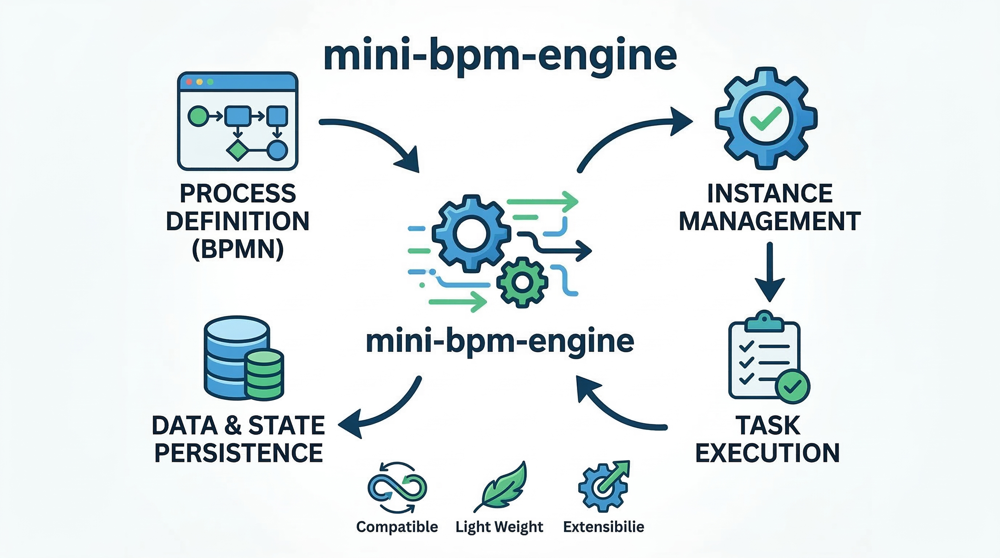

# mini-bpm



Eine einbettbare BPMN 2.0 Workflow-Engine in Rust.

## Crates (Module)

* `bpmn-parser`: Parst BPMN 2.0 XML-Definitionen in interne Rust-Strukturen.
* `engine-core`: Die Hauptbibliothek der Workflow-Engine, die Token, die Ausführung von Zuständen und Tasks verarbeitet.
* `persistence-nats`: (Optional) Bietet NATS-basierte Persistenz und JetStream-Event-Publishing.
* `engine-server`: Ein eigenständiger, auf Axum basierender HTTP-Server, der REST-API-Endpunkte für die Engine bereitstellt.
* `desktop-tauri`: Eine Tauri-Desktop-Anwendung, die mit der Workflow-Engine interagiert.
* `agent-orchestrator`: Ein Crate zur Orchestrierung von externen Agenten/Workern, die mit der Engine interagieren.

## Starten des Engine-Servers

Um den HTTP-REST-API-Server zu starten: 

```bash
# NATS starten (falls Persistenz genutzt werden soll)
docker-compose up -d nats

# Engine-Server ausführen
cargo run -p engine-server
```

Der Server lauscht standardmäßig auf `http://localhost:8080`.

### Endpunkte
* `POST /api/deploy` - Eine BPMN-Definition bereitstellen
* `POST /api/start` - Eine neue Prozessinstanz starten
* `GET /api/tasks` - Alle ausstehenden Benutzer-Tasks (User Tasks) auflisten
* `POST /api/complete/:id` - Einen Benutzer-Task abschließen
* `GET /api/instances` - Alle Prozessinstanzen auflisten
* `GET /api/instances/:id` - Details einer einzelnen Instanz abrufen
* `PUT /api/instances/:id/variables` - Variablen einer Prozessinstanz aktualisieren

#### Externe Tasks (External Tasks)
* `POST /api/external-task/fetchAndLock` - Tasks für Worker abrufen und sperren (inkl. Long-Polling)
* `POST /api/external-task/:id/complete` - Einen externen Task erfolgreich abschließen
* `POST /api/external-task/:id/failure` - Einen externen Task als fehlgeschlagen markieren
* `POST /api/external-task/:id/extendLock` - Die Sperrdauer eines Tasks verlängern
* `POST /api/external-task/:id/bpmnError` - Einen BPMN-Fehler für einen Task melden

## Ausführen der Desktop-Anwendung

Die `mini-bpm-desktop` Anwendung kann in zwei Modi ausgeführt werden:

1. **Eingebettete Engine (Standard)**: Die App führt ihre eigene In-Memory (oder NATS-gestützte) `WorkflowEngine` innerhalb des Tauri-Backends aus.
   ```bash
   cargo run -p mini-bpm-desktop
   ```

2. **HTTP-Backend**: Die App verbindet sich über HTTP mit der `engine-server` Instanz.
   ```bash
   cargo run -p mini-bpm-desktop --features http-backend
   ```
   *Hinweis: Stelle sicher, dass `engine-server` läuft, bevor die App in diesem Modus gestartet wird. Du kannst den API-Endpunkt über die Umgebungsvariable `ENGINE_API_URL` konfigurieren.*

### Tauri-Kommandos
Das Frontend der Desktop-Anwendung nutzt folgende Tauri-Kommandos zur Interaktion mit dem Backend:
* Deployment & Start: `deploy_definition`, `deploy_simple_process`, `start_instance`
* Instanzen: `list_instances`, `get_instance_details`, `update_instance_variables`
* Tasks: `get_pending_tasks`, `complete_task`
* Definitionen: `list_definitions`, `get_definition_xml`

## Docker Compose

Die gesamte Infrastruktur (NATS und `engine-server`) kann wie folgt gestartet werden:

```bash
docker-compose up --build
```
