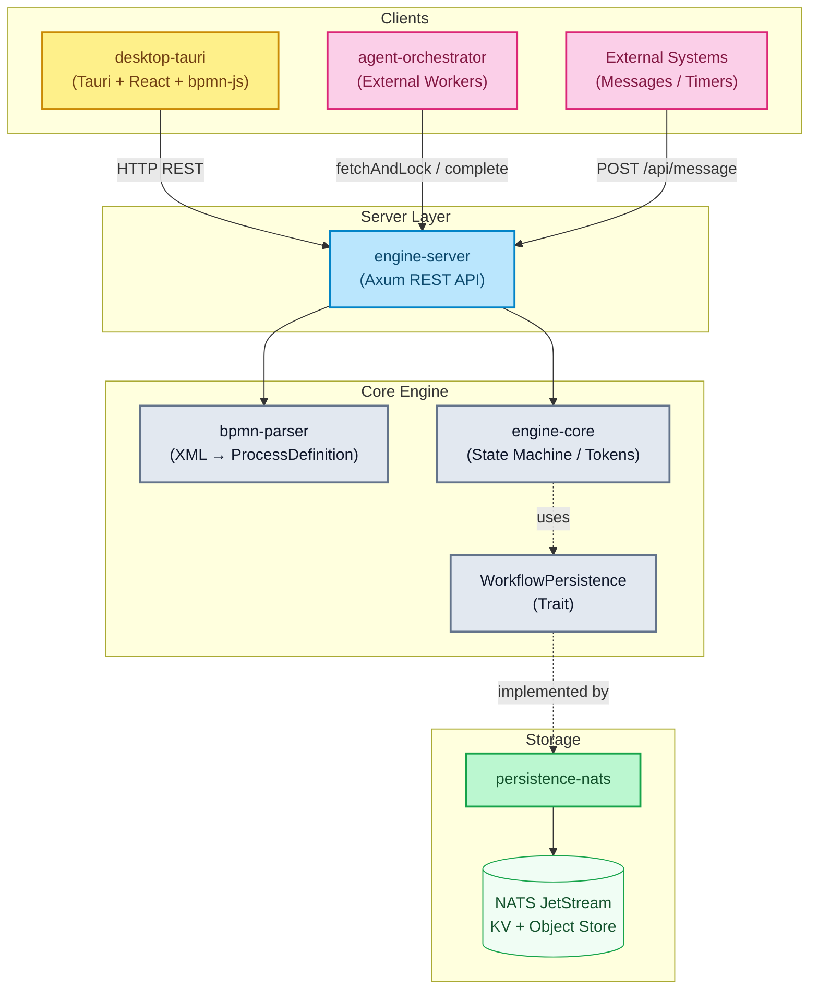

# BPMNinja

[](https://www.rust-lang.org/)
[]()
[]()
[](#lizenz)

<div align="center">
  
</div>

**Eine BPMN 2.0 Workflow-Engine in Rust** — token-basierte Ausführung, NATS-Persistenz, REST-API und Desktop-UI.

---

## Inhaltsverzeichnis

- [Überblick](#überblick)
- [Crates (Module)](#crates-module)
- [Unterstützte BPMN-Elemente](#unterstützte-bpmn-elemente)
- [Architektur](#architektur)
- [Schnellstart](#schnellstart)
- [REST API](#rest-api)
- [Desktop-Anwendung (UI)](#desktop-anwendung-ui)
- [Docker Compose](#docker-compose)
- [Test-Metriken](#test-metriken)
- [Roadmap](#roadmap)
- [Lizenz](#lizenz)

---

## Überblick

bpmninja ist eine leichtgewichtige BPMN 2.0 Engine mit folgenden Kernfeatures:

- **Token-basierte Ausführung** — jeder Pfad wird als eigenständiger Token verfolgt
- **18 BPMN-Elemente** — Start/End Events, User/Service Tasks, Gateways (XOR, AND, OR, Event-Based), Timer, Messages, Boundary Events, Call Activities, Sub-Processes
- **Lock-Free Concurrency** — Multi-threaded Skalierung dank `DashMap` Wait-State Queues
- **NATS JetStream Persistenz** — KV-Stores für Instanzen, Object Store für Dateien, Event-Streaming für History
- **Fault-Tolerant Retry Queue** — 2-stufiges Retry-System mit Background-Worker gegen NATS-Ausfälle
- **Automatischer Timer-Scheduler** — Background-Task verarbeitet abgelaufene Timer (konfigurierbar via `TIMER_INTERVAL_MS`)
- **Camunda-kompatible Service Tasks** — Fetch-and-Lock Pattern mit Long-Polling
- **Rhai Script Engine** — Execution Listeners für dynamische Variablenmanipulation
- **Desktop-UI** — Tauri-App mit bpmn-js Modeler und Live-Instanzverfolgung (inkl. plattformübergreifender GitHub Actions CI-Releases)

---

## Crates (Module)

| Crate | Zweck |
|-------|-------|
| **`engine-core`** | Kernbibliothek — State Machine, Token-Registry, Gateway-Routing, Condition-Evaluator, Script-Engine |
| **`bpmn-parser`** | Parst BPMN 2.0 XML (`quick-xml` + `serde`) zu internen `ProcessDefinition`-Structs |
| **`persistence-nats`** | NATS JetStream-basierte `WorkflowPersistence`-Implementierung (KV, Object Store, Streams) |
| **`engine-server`** | Axum HTTP REST-API mit typsicherem Error-Handling (`AppError` → HTTP-Statuscodes) |
| **`desktop-tauri`** | Tauri Desktop-App (React + bpmn-js) mit Modeler, Instanzen-Dashboard und Event-Historie |
| **`agent-orchestrator`** | Beispiel-Worker für externe Service-Task-Verarbeitung |

---

## Unterstützte BPMN-Elemente

### Basis-Elemente

| BPMN | Element | Beschreibung |
|:---:|---|---|
|  | **StartEvent** | Einfacher Startpunkt — Prozess wird sofort gestartet. |
|  | **TimerStartEvent** | Timer-gesteuerter Start nach ISO 8601 Dauer (`PT30S`, `PT5M`). |
|  | **MessageStartEvent** | Prozess wird durch eingehende Nachricht (via `messageName`) gestartet. |
|  | **EndEvent** | Endpunkt — Prozessinstanz wird als abgeschlossen markiert. |
|  | **TerminateEndEvent** | Endpunkt — Bricht alle aktiven Tokens sofort ab. |
|  | **ErrorEndEvent** | Terminiert den Prozess mit einem BPMN-Fehlercode (`errorCode`). |
|  | **UserTask** | Erstellt einen Pending-Task, der extern abgeschlossen werden muss. |
|  | **ServiceTask** | Externe Verarbeitung via Fetch-and-Lock Pattern (Camunda-kompatibel). |
|  | **ScriptTask** | Führt inline verankerte Scripte über die Rhai Engine aus. |
|  | **SendTask** | Versendet via Throw Event eine Message und läuft direkt weiter. |

### Gateways

| BPMN | Element | Beschreibung |
|:---:|---|---|
|  | **ExclusiveGateway (XOR)** | Genau ein Pfad wird gewählt (Bedingungsauswertung). Optionaler Default-Flow. |
|  | **ParallelGateway (AND)** | Alle Pfade werden parallel verfolgt (Token-Fork). Join wartet auf alle Tokens (JoinBarrier). |
|  | **InclusiveGateway (OR)** | Alle Pfade mit `true`-Bedingung werden parallel verfolgt. Join wartet auf erwartete Tokens. |
|  | **EventBasedGateway** | Execution pausiert bis genau eines der Ziel-Catch-Events (Timer/Message) auslöst. |

### Intermediate Events

| BPMN | Element | Beschreibung |
|:---:|---|---|
|  | **TimerCatchEvent** | Pausiert den Prozess bis ein Timer abläuft. Wird automatisch vom Timer-Scheduler verarbeitet. |
|  | **MessageCatchEvent** | Pausiert den Prozess bis eine passende Nachricht via `POST /api/message` korreliert wird. |
|  | **BoundaryTimerEvent** | An einen Task angeheftetes Timer-Event (interrupting). Timer wird bei Task-Abschluss automatisch storniert. |
|  | **BoundaryErrorEvent** | Fängt BPMN-Fehler (`errorCode`) eines ServiceTasks ab und leitet auf einen alternativen Pfad. |

### Aktivitäten & Sub-Prozesse

| BPMN | Element | Beschreibung |
|:---:|---|---|
|  | **CallActivity** | Ruft eine andere Prozessdefinition auf (`calledElement`). Variablen werden propagiert. |
|  | **EmbeddedSubProcess** | Eingebetteter Sub-Prozess (wird in den Graph geflattened). |
|  | **SubProcessEndEvent** | Internes End-Event eines Embedded-Sub-Process (generiert beim Flattening). |

### Zusätzliche Konzepte

| Feature | Beschreibung |
|---------|-------------|
| **Conditional Flows** | Kanten mit Bedingungen (`amount > 100`, `status == 'approved'`). Operatoren: `==`, `!=`, `>`, `>=`, `<`, `<=`, Truthy-Checks. |
| **Execution Listeners** | Start-/End-Scripts auf Nodes (Rhai). Können Variablen lesen und mutieren. |
| **Scope Event Listeners** | Timer-/Message-/Error-Event-Sub-Prozesse auf Scope-Ebene (interrupting/non-interrupting). |
| **Datei-Variablen** | Upload/Download von Dateien als Prozessvariablen via NATS Object Store. |
| **Message Correlation** | Matching über `messageName` + optionalem `businessKey`. |
| **BPMN Error Handling** | ServiceTasks melden Fehler via `bpmnError`. Routing an passendes `BoundaryErrorEvent`. |
| **Detail-Historie** | Lückenloses Event-Log mit Diffs, Snapshots und Aktoren (`User`, `Engine`, `Timer`, `ServiceWorker`). |
| **Persistente Wait-States** | Timer, Messages, User/Service Tasks überleben Server-Neustarts via NATS KV. |
| **Structured JSON Logging** | Konfigurierbar via `tracing-subscriber` mit JSON-Feature und `RUST_LOG` Filter. |

### Abweichungen vom BPMN 2.0 Standard

Aus Performance- und Architekturgründen (Keep-It-Simple) weicht bpmninja in einigen Punkten vom strikten BPMN 2.0 Standard ab:

- **Service Tasks (External Task Pattern):** Anstatt synchron Code innerhalb der Engine auszuführen, pausieren `Service Tasks` die Ausführung. Sie stellen den Task asynchron in eine Fetch-And-Lock-Queue (ähnlich Camunda), von wo aus externe Worker den Task abrufen (`topic`-basiert) und via API den Abschluss melden.
- **Embedded Sub-Processes (Flattening):** Eingebettete Sub-Prozesse werden direkt beim Parsen aufgelöst und tief in den Hauptgraphen eingefügt (**Flattening**). Es gibt zur Laufzeit keine komplex verschachtelten Instanz-Strukturen, sondern nur direkte Knotenfolgen. Rücksprünge aus dem Sub-Prozess erfolgen über simulierte `SubProcessEndEvent`s in demselben Variablen-Scope.
- **Script Tasks:** Die Auswertung von Skripten erfolgt nicht per JavaScript oder Groovy, sondern nativ in Rust via **Rhai Engine**.
- **Multi-Instance (Parallel):** Statt gekapselte Execution-Scopes pro Iteration zu öffnen, erzeugt das Engine-Forking simple parallele Tokens auf demselben Task-Objekt innerhalb der globalen Instanzvariablen.

### Aktuell nicht unterstützte BPMN-Elemente

Die Engine orientiert sich an einem zweckmäßigen und performanten Kern-Feature-Set. Folgende BPMN-Elemente werden derzeit **nicht** unterstützt und führen beim Deployment zu Parser-Fehlern oder werden vollständig ignoriert:

- **Weitere Task-Typen:** `BusinessRuleTask` (kein DMN-Support), `ManualTask`, `ReceiveTask`.
- **Spezifische Intermediate/Boundary Events:** `SignalEvent`, `EscalationEvent`, `CompensationEvent`, `CancelEvent`, `LinkEvent`.
- **Non-Interrupting Boundary Events:** Boundary Events arbeiten derzeit standardmäßig "Interrupting" (der angeheftete Task wird sofort abgebrochen). Non-Interrupting Events werden noch nicht unterstützt.
- **Erweiterte Sub-Prozesse:** `Transaction Sub-Process`, `Ad-Hoc Sub-Process`.
- **Spezialisierte Gateways:** `Complex Gateway`.
- **Data Objects / Data Stores:** Visuelle Datenobjekte und Assoziationen (`Data Input/Output Association`) werden ignoriert. Der Datenaustausch erfolgt ausnahmslos über den JSON-Variablen-State (`HashMap<String, serde_json::Value>`).

---

## Architektur

> Ausführliche Dokumentation mit 8 Mermaid-Diagrammen: **[docs/architecture.md](docs/architecture.md)**



---

## Schnellstart

### Voraussetzungen

**Variante A: Devbox** (empfohlen)
```bash
# Installiert automatisch Rust, Node.js und NATS
devbox shell
```

**Variante B: Manuell**
- Rust (via `rustup`)
- Node.js ≥ 18
- Docker & Docker Compose

### Build, Test & Lint

| Aktion | Devbox | Shell |
|--------|--------|-------|
| **Build** | `devbox run build` | `cargo build --workspace` |
| **Test** | `devbox run test` | `cargo test --workspace` |
| **Lint** | `devbox run lint` | `cargo clippy --workspace -- -D warnings` |
| **Format** | `devbox run fmt` | `cargo fmt --all --check` |

### Engine-Server starten

```bash
# 1. NATS starten
docker compose up -d nats

# 2. Engine-Server starten
cargo run -p engine-server
```

Der Server läuft auf `http://localhost:8081`.

#### Umgebungsvariablen

| Variable | Default | Beschreibung |
|----------|---------|-------------|
| `NATS_URL` | `nats://localhost:4222` | NATS Server URL |
| `PORT` | `8081` | HTTP Server Port |
| `TIMER_INTERVAL_MS` | `1000` | Timer-Scheduler Polling-Intervall (ms) |

---

## REST API

> Vollständige OpenAPI 3.0 Spezifikation: **[docs/openapi.yaml](docs/openapi.yaml)** | 🌐 **[API Portal (Redoc)](https://maatini.github.io/mini-bpm-engine/)** *(benötigt aktives GitHub Pages Deploy via /docs)*

### Definitionen

| Methode | Pfad | Beschreibung |
|---------|------|-------------|
| `POST` | `/api/deploy` | BPMN-Definition deployen (max. 10MB) |
| `GET` | `/api/definitions` | Alle Definitionen auflisten |
| `GET` | `/api/definitions/:id/xml` | BPMN-XML einer Definition abrufen |
| `DELETE` | `/api/definitions/:id` | Definition löschen (`?cascade=true` für inkl. Instanzen) |
| `DELETE` | `/api/definitions/bpmn/:bpmn_id` | Alle Versionen einer BPMN-ID löschen |

### Instanzen

| Methode | Pfad | Beschreibung |
|---------|------|-------------|
| `POST` | `/api/start` | Instanz starten (mit `definition_key`) |
| `POST` | `/api/start/latest` | Instanz der neuesten Version starten (mit `bpmn_process_id`) |
| `GET` | `/api/instances` | Alle Instanzen auflisten |
| `GET` | `/api/instances/:id` | Instanz-Details abrufen |
| `DELETE` | `/api/instances/:id` | Instanz löschen |
| `PUT` | `/api/instances/:id/variables` | Variablen aktualisieren |

### User Tasks

| Methode | Pfad | Beschreibung |
|---------|------|-------------|
| `GET` | `/api/tasks` | Alle pending User Tasks auflisten |
| `POST` | `/api/complete/:id` | User Task abschließen |

### Service Tasks (Camunda-kompatibel)

| Methode | Pfad | Beschreibung |
|---------|------|-------------|
| `GET` | `/api/service-tasks` | Alle Service Tasks auflisten |
| `POST` | `/api/service-task/fetchAndLock` | Tasks abrufen und sperren (Long-Polling) |
| `POST` | `/api/service-task/:id/complete` | Task erfolgreich abschließen |
| `POST` | `/api/service-task/:id/failure` | Task als fehlgeschlagen markieren |
| `POST` | `/api/service-task/:id/extendLock` | Lock verlängern |
| `POST` | `/api/service-task/:id/bpmnError` | BPMN-Fehler melden |

### Dateien

| Methode | Pfad | Beschreibung |
|---------|------|-------------|
| `POST` | `/api/instances/:id/files/:var` | Datei hochladen (multipart) |
| `GET` | `/api/instances/:id/files/:var` | Datei herunterladen |
| `DELETE` | `/api/instances/:id/files/:var` | Dateivariable löschen |

### Events & Messages

| Methode | Pfad | Beschreibung |
|---------|------|-------------|
| `POST` | `/api/message` | Nachricht korrelieren |
| `POST` | `/api/timers/process` | Abgelaufene Timer manuell verarbeiten |

### Monitoring & Health

| Methode | Pfad | Beschreibung |
|---------|------|-------------|
| `GET` | `/api/health` | Liveness Check → `200 OK` |
| `GET` | `/api/ready` | Readiness Check (prüft NATS-Verbindung) |
| `GET` | `/api/info` | Backend-Informationen (Typ, NATS-URL, Status) |
| `GET` | `/api/monitoring` | Engine-Statistiken (Instanzen, Tasks, Storage, Fehler) |
| `GET` | `/api/monitoring/buckets/:bucket/entries` | KV-Bucket Einträge auflisten |
| `GET` | `/api/monitoring/buckets/:bucket/entries/:key` | Einzelnen KV-Eintrag laden |
| `GET` | `/api/instances/:id/history` | Event-Historie einer Instanz |
| `GET` | `/api/instances/:id/history/:eid` | Einzelnes History-Event |

### Fehlerbehandlung

Alle Fehler folgen einem einheitlichen JSON-Format:

```json
{ "error": "Human-readable error message" }
```

| HTTP-Code | Bedeutung |
|-----------|-----------|
| `400` | Ungültige Anfrage (Bad XML, ungültige UUID, fehlende Felder) |
| `404` | Ressource nicht gefunden (Definition, Instanz, Task, Node) |
| `409` | Konflikt (Task nicht pending, bereits gesperrt, bereits abgeschlossen) |
| `500` | Interner Serverfehler |

---

## Desktop-Anwendung (UI)

Die Tauri-App verbindet sich über HTTP mit dem `engine-server`.

> **Voraussetzung**: Engine-Server muss laufen. API-URL konfigurierbar via `ENGINE_API_URL` (Default: `http://localhost:8081`).

```bash
# Devbox
devbox run ui:dev

# Oder manuell
cd desktop-tauri && npm install && npm run tauri dev
```

---

## Docker Compose

Startet NATS + Engine-Server als Container:

```bash
# Devbox
devbox run engine:docker

# Oder manuell
docker compose up --build
```

Services erreichbar unter `localhost:8081` (API) und `localhost:4222` (NATS).

---

## Test-Metriken

> Ermittelt via `cargo test --workspace` am 05.04.2026 — **140 Tests, 0 Fehler**

### Workspace-Übersicht

| Crate | Unit | E2E | Gesamt |
|-------|------|-----|--------|
| **engine-core** | 96 | — | 96 |
| **bpmn-parser** | 6 | — | 6 |
| **persistence-nats** | 2 | — | 2 |
| **engine-server** | — | 36 | 36 |
| **Gesamt** | **104** | **36** | **140** ✅ |

### engine-core Breakdown (96 Tests)

| Modul | Tests | Abdeckung |
|-------|-------|-----------|
| `engine::tests` | 53 | State Machine, Gateways, User/Service Tasks, Boundary Events, Call Activities, EventBasedGateway, Timers, Messages, Error Propagation, Mutation-Checks |
| `engine::stress_tests` | 22 | Throughput (1000 Instanzen), Gateway-Korrektheit, Crash Recovery, Concurrency, Race Conditions, Memory (10k Instanzen) |
| `model::tests` | 17 | ProcessDefinition Builder, Token-Serialisierung, SequenceFlow, Validation, FileReference, Gateway-Constraints, EventBasedGateway-Constraints |
| `history::tests` | 4 | Diff-Berechnung, File-Upload-Erkennung, Human-Readable Text, Empty Diffs |

### engine-server E2E Tests (36 Tests, 12 Dateien)

| Testdatei | Tests | Abdeckung |
|-----------|-------|-----------|
| `e2e_deploy.rs` | 3 | Deploy, Start, Parallel Gateway |
| `e2e_file_variables.rs` | 3 | File Upload, Task Completion mit Files, Multi-File + Delete |
| `e2e_files.rs` | 1 | Upload/Download/Delete Lifecycle |
| `e2e_gateways.rs` | 1 | Parallel Gateway über HTTP |
| `e2e_history.rs` | 1 | History-Generierung und -Abfrage |
| `e2e_lifecycle.rs` | 6 | Instanz löschen, Definition löschen, Unbekannte Instanzen, Timer verarbeiten, Message korrelieren |
| `e2e_monitoring.rs` | 4 | Health, Ready (verbunden/unverbunden), Info, Monitoring Stats |
| `e2e_service_tasks.rs` | 7 | List Service Tasks, FetchAndLock, ExtendLock, Complete, Complete with Failure, BPMN-Error, Lock Conflict |
| `e2e_start_errors.rs` | 4 | Invalid UUID, Unknown Definition, Unknown BPMN-ID, Timer-Start Rejection |
| `e2e_stress.rs` | 2 | Concurrent Deployments, Concurrent Starts (multi-thread) |
| `e2e_variables.rs` | 1 | Variable-Updates mid-execution |
| `e2e_versioning.rs` | 3 | Version-Inkrement, Start-Latest, Instance-Isolation |

### Mutation Testing

| Metrik | Wert |
|--------|------|
| Generierte Mutanten | 301 |
| Caught (erkannt) | 133 |
| Missed | 10 |
| **Mutation Score** | **93.0%** ✅ |

### Code-Statistiken

| Bereich | Dateien | LoC |
|---------|---------|-----|
| engine-core (Lib) | 24 | 5.450 |
| engine-core (Tests) | 2 | 2.482 |
| bpmn-parser | 4 | 867 |
| persistence-nats | 5 | 970 |
| engine-server (Lib) | 12 | 1.125 |
| engine-server (E2E Tests) | 12 | 1.649 |
| desktop-tauri (TypeScript + CSS) | 38 | 5.187 |
| desktop-tauri (Rust Backend) | 10 | 623 |
| **Rust Workspace** | **59** | **~12.543** |
| **Projekt Gesamt** | **~107** | **~18.353** |

---

## Roadmap

| Feature | Status |
|---------|--------|
| Embedded Subprozesse (BPMN Scopes) | ✅ Implementiert |
| Event-Based Gateway | ✅ Implementiert |
| Structured JSON Logging (`tracing-subscriber` + JSON) | ✅ Implementiert |
| Multi-Node Cluster (NATS-basiertes Token-Locking) | 🔲 Geplant |
| OIDC/OAuth2 Middleware | 🔲 Geplant |
| Prometheus Metrics Endpoint | 🔲 Geplant |

---

## Lizenz

Dieses Projekt ist unter einer der folgenden Lizenzen lizenziert, nach deiner Wahl:

- [MIT License](LICENSE-MIT)
- [Apache License, Version 2.0](LICENSE-APACHE)

