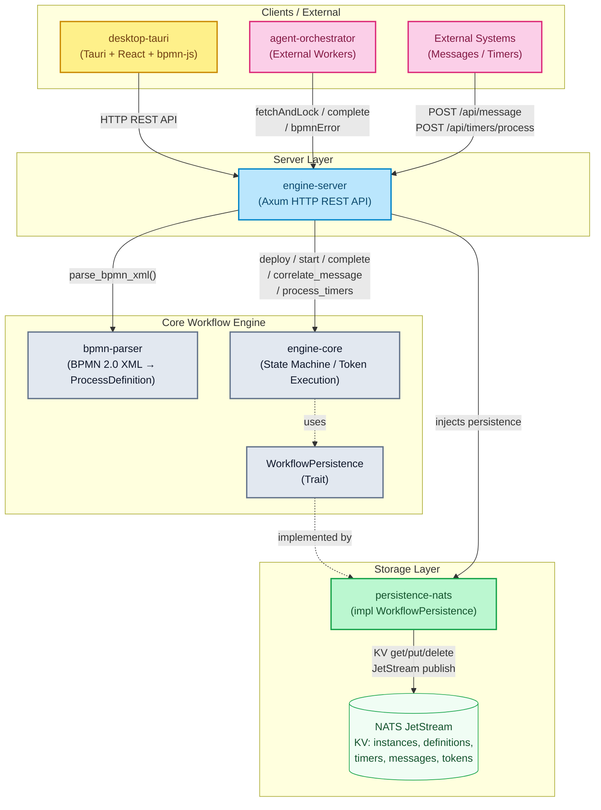

# mini-bpm

[](https://github.com/maatini/mini-bpm-engine/stargazers)
[](https://github.com/maatini/mini-bpm-engine/network/members)
[](https://github.com/maatini/mini-bpm-engine/issues)
[](https://www.rust-lang.org/)


Eine einbettbare BPMN 2.0 Workflow-Engine in Rust.

## Crates (Module)

* `bpmn-parser`: Parst BPMN 2.0 XML-Definitionen in interne Rust-Strukturen.
* `engine-core`: Die Hauptbibliothek der Workflow-Engine — token-basierte Ausführung, Gateway-Routing mit Condition-Evaluator, Script-Engine (Execution Listeners), Service-Task-Support und umfassendes Error-Handling via `EngineError` (thiserror). Tests sind in ein separates Modul (`tests.rs`) ausgelagert.
* `persistence-nats`: (Optional) Bietet NATS-basierte Persistenz. Nutzt JetStream KV-Stores für Instanzen, Definitionen und Pending-Tasks, sowie einen Object Store (`bpmn_xml`) für die originalen BPMN-Dateien. Darüber hinaus wird ein Event-Sourcing-Ansatz via JetStream Publishing unterstützt.
* `engine-server`: Ein Axum-basierter HTTP-Server mit REST-API. Nutzt einen typsicheren `AppError`-Enum für konsistente HTTP-Fehlercodes (400/404/409/500).
* `desktop-tauri`: Eine Tauri-Desktop-Anwendung (React, bpmn-js), die mit der Workflow-Engine interagiert. Bietet einen integrierten Modeler, eine Instanzen-Ansicht mit automatisch zentrierender Diagramm-Visualisierung und eine tabellarische Event-Historie inklusiver JSON-Diffs.
* `agent-orchestrator`: Ein Crate zur Orchestrierung von externen Agenten/Workern, die mit der Engine interagieren.

## Unterstützte BPMN-Elemente

### Basis-Elemente

| BPMN | Element | Beschreibung |
|:---:|---|---|
|  | **StartEvent** | Einfacher Startpunkt — Prozess wird sofort gestartet. |
|  | **TimerStartEvent** | Timer-gesteuerter Start nach einer konfigurierbaren ISO 8601 Dauer (`PT30S`, `PT5M`). |
|  | **MessageStartEvent** | Prozess wird durch eine eingehende Nachricht (via `messageName`) gestartet. |
|  | **EndEvent** | Endpunkt — Prozessinstanz wird als abgeschlossen markiert. |
|  | **ErrorEndEvent** | Terminiert den Prozess mit einem BPMN-Fehlercode (`errorCode`). |
|  | **UserTask** | Erstellt einen Pending-Task, der extern abgeschlossen werden muss. |
|  | **ServiceTask** | Tasks, die von externen Workern (z.B. agent-orchestrator) per fetch-and-lock abgearbeitet werden. |

### Gateways

| BPMN | Element | Beschreibung |
|:---:|---|---|
|  | **ExclusiveGateway (XOR)** | Genau ein ausgehender Pfad wird gewählt (Bedingungsauswertung). Optionaler Default-Flow. |
|  | **ParallelGateway (AND)** | Alle ausgehenden Pfade werden bedingungslos verfolgt (Token-Fork). Als Join wartet es auf **alle** eingehenden Tokens (JoinBarrier) und mergt deren Variablen. |
|  | **InclusiveGateway (OR)** | Alle Pfade, deren Bedingung `true` ergibt, werden parallel verfolgt (Token-Forking). Als Join wartet es auf alle erwarteten Tokens. |

### Events (Phase 1)

| BPMN | Element | Beschreibung |
|:---:|---|---|
|  | **TimerCatchEvent** | Intermediate Catch Event — pausiert den Prozess bis ein Timer abläuft. Auflösung via `POST /api/timers/process`. |
|  | **MessageCatchEvent** | Intermediate Catch Event — pausiert den Prozess bis eine Nachricht mit passendem `messageName` korreliert wird. |
|  | **BoundaryTimerEvent** | An einen Task angeheftetes Timer-Event (interrupting). Unterbricht den Task wenn der Timer abläuft. Timer wird bei Task-Abschluss automatisch storniert. |
|  | **BoundaryErrorEvent** | An einen ServiceTask angeheftetes Error-Event. Fängt BPMN-Fehler (`errorCode`) ab und leitet den Token auf einen alternativen Pfad um. |

### Zusätzliche Konzepte

* **Conditional Sequence Flows** — Kanten können Bedingungsausdrücke tragen (z.B. `amount > 100`, `status == 'approved'`). Der integrierte Condition-Evaluator unterstützt `==`, `!=`, `>`, `>=`, `<`, `<=` sowie Truthy-Checks.
* **Execution Listeners** — Nodes können Start- und End-Scripts besitzen, die Prozessvariablen lesen und mutieren (z.B. `x = x * 2; if x > 10 { result = "big" }`).
* **Dynamische Prozessvariablen** — Variablen laufender Instanzen können zur Laufzeit via REST-API aktualisiert werden. Änderungen werden in der NATS-Persistenz automatisch mit pausierten Tokens von Pending-Tasks synchronisiert.
* **Datei-Variablen** — Integrierte Unterstützung für Datei-Uploads und Downloads als vollwertige Prozessvariablen, sicher persistiert im NATS JetStream Object Store.
* **Message Correlation** — Eingehende Nachrichten werden über `messageName` und optional `businessKey` an wartende Instanzen oder als Startimpuls an passende Definitionen korreliert.
* **Timer-Verarbeitung** — Pending-Timer werden via Polling (`process_timers()`) aufgelöst. Boundary-Timer werden bei Task-Abschluss automatisch storniert (`cancel_boundary_timers`). **Hinweis**: Die Engine nutzt aktuell keinen internen Background-Thread für Timer-Polling. Timers müssen von einem externen Cronjob über den Endpunkt `POST /api/timers/process` regelmäßig aufgerufen werden.
* **BPMN Error Handling** — Service-Tasks können via `bpmnError`-Endpunkt Fehler melden. Die Engine routet den Token an das passende `BoundaryErrorEvent` (Matching via `errorCode`).
* **Detail-Historie** — Das Audit-Log der Engine liefert ein lückenloses Playback aller Token-Routings und State-Veränderungen, detailliert aufgeschlüsselt nach den zugehörigen Aktoren (`User`, `Engine`, `Timer`, `ServiceWorker`).
* **Persistente Wait-States** — Timer und Message Catches werden in NATS KV-Stores persistiert und überleben damit Server-Neustarts.

## Architektur

> Ausführliche Architektur-Dokumentation mit 8 Mermaid-Diagrammen: **[docs/architecture.md](docs/architecture.md)**

Das folgende Diagramm zeigt die Gesamtstruktur des mini-bpm Projekts:



## Voraussetzungen

Du kannst dieses Projekt entweder in einer isolierten Devbox-Umgebung (empfohlen) oder mit lokal installierten Tools entwickeln.

### Variante A: Devbox (Empfohlen)
Dieses Projekt nutzt [Devbox](https://www.jetify.com/devbox) für eine reproduzierbare Umgebung.
1. Installiere Devbox auf deinem System.
2. Führe im Projektverzeichnis `devbox shell` aus. Dies installiert automatisch Rust, Node.js und den NATS-Server in der isolierten Umgebung.

### Variante B: Manuell (Shell)
Folgende Tools müssen auf deinem System installiert sein:
- Rust (via `rustup`)
- Node.js (≥ 18)
- Docker & Docker Compose (für NATS)

## Test-Metriken

### Workspace Test Summary

| Crate | Unit Tests | E2E / Integration Tests | Gesamt |
|---|---|---|---|
| **engine-core** | 88 | — | 88 |
| **bpmn-parser** | 13 | — | 13 |
| **persistence-nats** | 2 | — | 2 |
| **engine-server** | — | 15 | 15 |
| **Gesamt** | **103** | **15** | **118** ✅ |

#### engine-core Test-Breakdown

| Modul | Tests | Abdeckung |
|---|---|---|
| `engine::tests` | 44 | State Machine, Gateways, User/Service Tasks, Boundary Events, Call Activities, Variables, Timers, Messages |
| `engine::stress_tests` | 22 | Massentests für Durchsatz, Gateways, Crash Recovery, Concurrency, Observability und Boundary Conditions |
| `model::tests` | 15 | ProcessDefinition Builder, Token, SequenceFlow, Validation, FileReference |
| `history::tests` | 4 | History Diff-Berechnung, File-Upload-Erkennung, Human-Readable Text |

### Stress-Tests & Architektur-Härtung

Die Engine wurde durch über **45+ dedizierte Stress-Assertionen** gehärtet. Alle kritischen Race-Conditions und Concurrency-Bugs wurden beseitigt:

* **Throughput & Scaling:** Tests mit 1.000 linearen Instanzen und parallelen API-Aufrufen validieren den Lock-Mechanismus sowie den Durchsatz (Memory und Speed). 100.000 Prozess-Schritte können in wenigen Millisekunden aufgelöst werden.
* **HTTP Last-Tests:** Der Axum Server bewältigt exzessives asynchrones Deployment (`POST /api/deploy`) via massenhaften Token Starts absolut stabil. Größere BPMN/XML Payloads werden sicher abgewiesen (OOM-Schutz über 10MB Body-Limit).
* **Parser-Robustheit:** Generierte BPMN-XML Grafiken mit >10.000 verschachtelten Taks werden vom Parser iterativ evaluiert. Die Engine fängt fehlerhafte/unendlich loopende Skripte in Execution-Listeners ab (auf `10.000` Operations limitiert).
* **Crash Recovery & NATS:** Im Fall eines Server-Absturzes während eines Token-Splits (Parallel Gateways) oder langen Wait-States wird der gesamte AST inklusiv Audit-Historie atomar wieder geladen — die Execution geht dort weiter, wo sie unterbrochen wurde.

### Code-Statistiken

| Crate | Dateien | LOC (ohne Tests) |
|---|---|---|
| **engine-core** | 10 | 4.365 |
| **engine-core** (tests) | 1 | 1.457 |
| **bpmn-parser** | 2 | 912 |
| **persistence-nats** | 2 | 721 |
| **engine-server** | 3 + 4 E2E | 919 + 520 |
| **Rust Workspace** | **22** | **~8.900** |
| desktop-tauri (TypeScript) | ~17 | ~8.500 |
| **Projekt Gesamt** | **~39** | **~17.400** |

### Mutation Testing (cargo-mutants, engine-core)

| Metrik | Wert |
|---|---|
| Generierte Mutanten | 301 |
| Unviable (kompiliert nicht) | 158 (52.4%) |
| Caught (von Tests erkannt) | 133 |
| Missed (nicht erkannt) | 10 |
| **Mutation Score** | **93.0%** ✅ |

> [!NOTE]
> Einer der härtesten Prüfsteine in Rust: Durch unsere fokussierten Edge-Case-Tests (Verifizieren von iterativen Listen, Inkrement-Zuweisungen und String-Exaktheiten) konnte der PIT / Mutanten-Score erfolgreich auf **>90%** angehoben werden!

### API Integration Tests (engine-server)

| Metrik | Wert |
|---|---|
| Test-Dateien | 8 (`deploy`, `variables`, `files`, `file_variables`, `history`, `gateways`, `versioning`, `stress`) |
| Tests | 15 |
| Passed | 15 |
| **Pass Rate** | **100%** ✅ |

> [!NOTE]
> Die Rust `engine-server` E2E-Tests validieren Massenabfragen, Multipart-Datei Handling, BPMN-Versionsmanagement und Gateway-Echtzeitausführungen über den asynchronen Axum Stack.

### E2E Tests (Playwright, desktop-tauri)

| Metrik | Wert |
|---|---|
| Tests | 27 |
| Passed | 27 |
| **E2E Pass Rate** | **100%** ✅ |

### Coverage ermitteln

```bash
# Voraussetzung: cargo-llvm-cov installiert
rustup component add llvm-tools-preview
cargo install cargo-llvm-cov

# Coverage Report
cargo llvm-cov --workspace --exclude mini-bpm-desktop

# Mutation Testing (engine-core)
cargo install cargo-mutants
cargo mutants --package engine-core
```

## Build, Test & Lint

| Aktion | Variante A: Devbox | Variante B: Manuell (Shell) |
|---|---|---|
| **Build** | `devbox run build` | `cargo build --workspace` |
| **Test** | `devbox run test` | `cargo test --workspace` |
| **Lint** | `devbox run lint` | `cargo clippy --workspace -- -D warnings` |
| **Format Check** | `devbox run fmt` | `cargo fmt --all --check` |

## Engine-Server starten

Der Engine-Server benötigt eine laufende NATS-Instanz für die Persistenz. 

### Variante A: Devbox

```bash
# NATS lokal via Docker starten
devbox run nats:up

# Engine-Server ausführen
devbox run engine:run
```

### Variante B: Manuell (Shell)

```bash
# NATS im Hintergrund starten
docker compose up -d nats

# Engine-Server ausführen
cargo run -p engine-server
```

Der Server lauscht standardmäßig auf `http://localhost:8081`. 
*Hinweis: Wenn NATS auf einem anderen Port als 4222 läuft, kann dies via Umgebungsvariable `NATS_URL` angepasst werden.*

### REST API Endpunkte

* `POST /api/deploy` - Eine BPMN-Definition bereitstellen
* `POST /api/start` - Eine neue Prozessinstanz starten
* `GET /api/tasks` - Alle ausstehenden Benutzer-Tasks (User Tasks) auflisten
* `POST /api/complete/:id` - Einen Benutzer-Task abschließen
* `GET /api/instances` - Alle Prozessinstanzen auflisten
* `GET /api/instances/:id` - Details einer einzelnen Instanz abrufen
* `GET /api/instances/:id/history` - Event-Historie einer Instanz abrufen (mit Filter-Query-Params)
* `GET /api/instances/:id/history/:event_id` - Einzelnes History-Event abrufen
* `PUT /api/instances/:id/variables` - Variablen einer Prozessinstanz aktualisieren
* `POST /api/instances/:id/files/:filename` - Eine Datei als Prozessvariable hochladen (multipart/form-data)
* `GET /api/instances/:id/files/:filename` - Eine hochgeladene Datei herunterladen
* `DELETE /api/instances/:id/files/:filename` - Eine Dateivariable löschen
* `DELETE /api/instances/:id` - Eine Prozessinstanz löschen
* `GET /api/definitions` - Alle bereitgestellten Definitionen auflisten
* `GET /api/definitions/:id/xml` - Das originale BPMN-XML einer Definition abrufen
* `DELETE /api/definitions/:id` - Eine Prozessdefinition löschen (Query `?cascade=true` zum Mitlöschen aller Instanzen)

#### Service Tasks
* `GET /api/service-tasks` - Alle ausstehenden Service Tasks auflisten
* `POST /api/service-task/fetchAndLock` - Tasks für Worker abrufen und sperren (inkl. Long-Polling)
* `POST /api/service-task/:id/complete` - Einen Service Task erfolgreich abschließen
* `POST /api/service-task/:id/failure` - Einen Service Task als fehlgeschlagen markieren
* `POST /api/service-task/:id/extendLock` - Die Sperrdauer eines Tasks verlängern
* `POST /api/service-task/:id/bpmnError` - Einen BPMN-Fehler für einen Task melden

#### Messages & Timers
* `POST /api/message` - Eine Nachricht korrelieren (löst wartende `MessageCatchEvents` auf oder startet `MessageStartEvent`-Prozesse)
* `POST /api/timers/process` - Alle abgelaufenen Timer verarbeiten (löst wartende `TimerCatchEvents` und `BoundaryTimerEvents` auf)

#### Info & Monitoring
* `GET /api/info` - Backend-Informationen abrufen (Typ, NATS-URL, Verbindungsstatus)
* `GET /api/monitoring` - Monitoring-Daten abrufen (Zähler für Definitionen, Instanzen, Tasks, Storage-Info)

## Desktop-Anwendung (UI) starten

Die `mini-bpm-desktop` Anwendung ist ein "Thin Client", der sich ausschließlich über HTTP mit der `engine-server` Instanz verbindet. 

> [!CAUTION]  
> Stelle sicher, dass der Engine-Server läuft, bevor die UI gestartet wird. Du kannst den API-Endpunkt über die Umgebungsvariable `ENGINE_API_URL` umleiten (Standard: `http://localhost:8081`).

### Variante A: Devbox

```bash
devbox run ui:dev
```

### Variante B: Manuell (Shell)

```bash
cd desktop-tauri
npm install
npm run tauri dev
```

### Tauri-Kommandos
Das Frontend der Desktop-Anwendung nutzt folgende Tauri-Kommandos zur Interaktion mit dem eigenen Backend, welches wiederum die HTTP Rest-Aufrufe zum Engine-Server macht:
* **Deployment & Start**: `deploy_definition`, `deploy_simple_process`, `start_instance`
* **Instanzen**: `list_instances`, `get_instance_details`, `get_instance_history`, `update_instance_variables`, `delete_instance`
* **User Tasks**: `get_pending_tasks`, `complete_task`
* **Service Tasks**: `get_pending_service_tasks`, `fetch_and_lock_service_tasks`, `complete_service_task`
* **Definitionen**: `list_definitions`, `get_definition_xml`, `delete_definition`
* **Konfiguration & Monitoring**: `get_api_url`, `set_api_url`, `get_monitoring_data`
* **Dateisystem**: `read_bpmn_file`

## Komplette Infrastruktur starten (Docker Compose)

Um NATS und den Engine-Server gemeinsam und isoliert auszuführen:

### Variante A: Devbox

```bash
devbox run engine:docker
```

### Variante B: Manuell (Shell)

```bash
docker compose up --build
```
*(Die Services sind anschließend unter `localhost:8081` und `localhost:4222` erreichbar)*

## Agent Orchestrator (Externer Worker)

Der `agent-orchestrator` ist ein Beispiel für einen externen Microservice, der periodisch nach anstehenden "Service Tasks" im Engine-Server fragt (`fetchAndLock`), diese abarbeitet und anschließend bei der Engine als erledigt meldet.

Um das Zusammenspiel zu testen, stellen Sie sicher, dass NATS und der Engine-Server bereits laufen. Öffnen Sie dann ein neues Terminal:

### Variante A & B: Identischer Befehl (Cargo)

*(Sollte `cargo` nicht installiert sein, vorher `devbox shell` aufrufen)*

```bash
cargo run -p agent-orchestrator
```

## Fehlende Use-Cases & Offene Roadmap

Trotz der stabilen Architektur existieren noch Limitationen und konzeptionelle Punkte für weitere Ausbaustufen, die noch **nicht** vollständig von der Engine unterstützt werden:

1. **Echte Multi-Node Cluster Architektur:** Aktuell ist ein NATS-Setup als Speicherschicht für Worker integriert, aber das Load-Balancing und Partitionieren von In-Memory Zustand über *mehrere gleichzeitige Server Node Instanzen* der `engine-core` hinweg erfordert NATS Core Locksing der Token-Evaluation.
2. **Subprozesse (Embedded & Call-Activity):** Bislang werden eingebettete Subprozesse (Scopes) noch nicht unterstützt (`bpmn-parser` blockt diese explizit als inkompatibel). CallActivities werden derzeit provisorisch als reguläre Service Tasks interpretiert.
3. **Erweiterte Gateways:** Complex Gateways oder ein echtes Event-Based Gateway fehlen noch in der BPMN Interpretation.
4. **Interne Background Worker für Timer Polling:** Aktuell müssen Timer via Endpunkt (`POST /api/timers/process`) explizit und regelmäßig extern getriggert werden. Ein interner Daemon/Thread-Loop im Crate `engine-core`, der dies asynchron über Tokio übernimmt, steht aus.
5. **Vollständige OIDC/OAuth2 Integration:** Zwar ist der Axum HTTP-Adapter für Authentication offengelegt, es fehlen jedoch Token-Validierungs-Middleware (Oauth JWK) und granulare User-Roles/Tenants.
