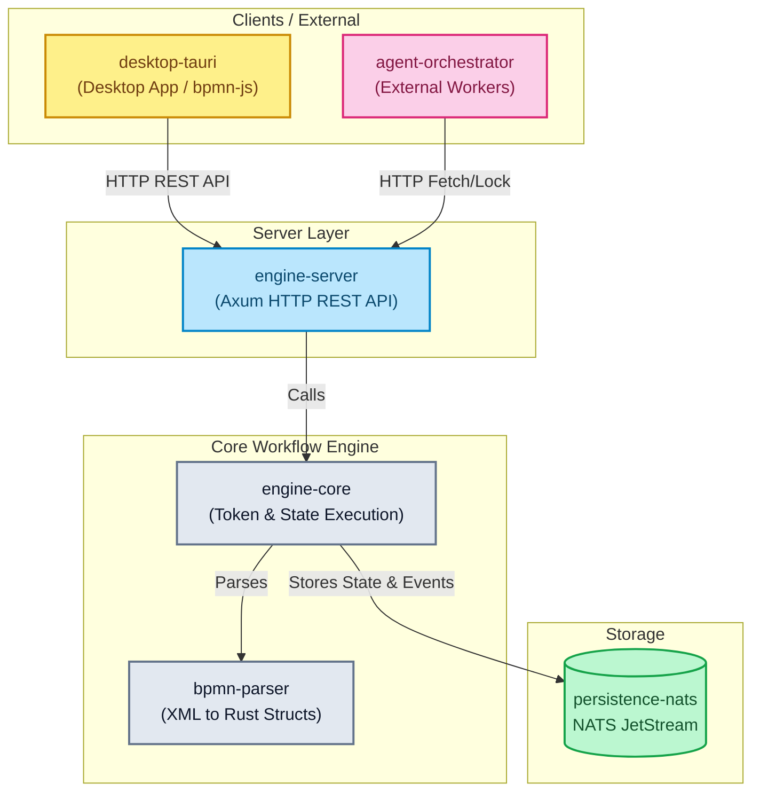

# mini-bpm

[](https://github.com/maatini/mini-bpm-engine/stargazers)
[](https://github.com/maatini/mini-bpm-engine/network/members)
[](https://github.com/maatini/mini-bpm-engine/issues)
[](https://www.rust-lang.org/)


Eine einbettbare BPMN 2.0 Workflow-Engine in Rust.

## Crates (Module)

* `bpmn-parser`: Parst BPMN 2.0 XML-Definitionen in interne Rust-Strukturen.
* `engine-core`: Die Hauptbibliothek der Workflow-Engine — token-basierte Ausführung, Gateway-Routing mit Condition-Evaluator, Script-Engine (Execution Listeners), Service-Task-Support und umfassendes Error-Handling via `EngineError` (thiserror). Tests sind in ein separates Modul (`tests.rs`) ausgelagert.
* `persistence-nats`: (Optional) Bietet NATS-basierte Persistenz. Nutzt JetStream KV-Stores für Instanzen, Definitionen und Pending-Tasks, sowie einen Object Store (`bpmn_xml`) für die originalen BPMN-Dateien. Darüber hinaus wird ein Event-Sourcing-Ansatz via JetStream Publishing unterstützt.
* `engine-server`: Ein Axum-basierter HTTP-Server mit REST-API. Nutzt einen typsicheren `AppError`-Enum für konsistente HTTP-Fehlercodes (400/404/409/500).
* `desktop-tauri`: Eine Tauri-Desktop-Anwendung (React, bpmn-js), die mit der Workflow-Engine interagiert. Bietet einen integrierten Modeler, eine Instanzen-Ansicht mit automatisch zentrierender Diagramm-Visualisierung und eine tabellarische Event-Historie inklusiver JSON-Diffs.
* `agent-orchestrator`: Ein Crate zur Orchestrierung von externen Agenten/Workern, die mit der Engine interagieren.

## Unterstützte BPMN-Elemente

| Element | Beschreibung |
|---|---|
| **StartEvent** | Einfacher Startpunkt — Prozess wird sofort gestartet. |
| **TimerStartEvent** | Timer-gesteuerter Start nach einer konfigurierbaren Dauer. |
| **EndEvent** | Endpunkt — Prozessinstanz wird als abgeschlossen markiert. |
| **ServiceTask** | Tasks, die von externen Workern (z.B. agent-orchestrator) per fetch-and-lock abgearbeitet werden. |
| **UserTask** | Erstellt einen Pending-Task, der extern abgeschlossen werden muss. |
| **ExclusiveGateway (XOR)** | Genau ein ausgehender Pfad wird gewählt (Bedingungsauswertung). Optionaler Default-Flow. |
| **ParallelGateway (AND)** | Alle ausgehenden Pfade werden bedingungslos verfolgt (Token-Fork). Als Join wartet es auf **alle** eingehenden Tokens (JoinBarrier) und mergt deren Variablen. |
| **InclusiveGateway (OR)** | Alle Pfade, deren Bedingung `true` ergibt, werden parallel verfolgt (Token-Forking). Als Join wartet es auf alle erwarteten Tokens. |

### Zusätzliche Konzepte

* **Conditional Sequence Flows** — Kanten können Bedingungsausdrücke tragen (z.B. `amount > 100`, `status == 'approved'`). Der integrierte Condition-Evaluator unterstützt `==`, `!=`, `>`, `>=`, `<`, `<=` sowie Truthy-Checks.
* **Execution Listeners** — Nodes können Start- und End-Scripts besitzen, die Prozessvariablen lesen und mutieren (z.B. `x = x * 2; if x > 10 { result = "big" }`).
* **Dynamische Prozessvariablen** — Variablen laufender Instanzen können zur Laufzeit via REST-API aktualisiert werden. Änderungen werden in der NATS-Persistenz automatisch mit pausierten Tokens von Pending-Tasks synchronisiert.
* **Detail-Historie** — Das Audit-Log der Engine liefert ein lückenloses Playback aller Token-Routings und State-Veränderungen, detailliert aufgeschlüsselt nach den zugehörigen Aktoren (`User`, `Engine`, `External Worker`).

## Architektur

Das folgende Diagramm nutzt Mermaid, um die hochauflösende Vektor-Struktur des mini-bpm Projekts darzustellen:



## Voraussetzungen

Du kannst dieses Projekt entweder in einer isolierten Devbox-Umgebung (empfohlen) oder mit lokal installierten Tools entwickeln.

### Variante A: Devbox (Empfohlen)
Dieses Projekt nutzt [Devbox](https://www.jetify.com/devbox) für eine reproduzierbare Umgebung.
1. Installiere Devbox auf deinem System.
2. Führe im Projektverzeichnis `devbox shell` aus. Dies installiert automatisch Rust, Node.js und den NATS-Server in der isolierten Umgebung.

### Variante B: Manuell (Shell)
Folgende Tools müssen auf deinem System installiert sein:
- Rust (via `rustup`)
- Node.js (≥ 18)
- Docker & Docker Compose (für NATS)

## Test-Metriken

### Code Coverage (cargo-llvm-cov)

| Crate / Modul | Lines | Covered | Line Coverage |
|---|---|---|---|
| **engine-core** `model.rs` | 335 | 322 | **96.1%** ✅ |
| **engine-core** `engine.rs` | 1033 | 858 | **83.0%** |
| **engine-core** `condition.rs` | 74 | 60 | **81.0%** |
| **engine-core** `script_runner.rs` | 57 | 54 | **94.7%** ✅ |
| **engine-core** `service_task.rs` | 241 | 225 | **93.3%** ✅ |
| **engine-core** `history.rs` | 187 | 173 | **92.5%** ✅ |
| **engine-core** `tests.rs` | 1720 | 1712 | **99.5%** ✅ |
| **bpmn-parser** | 334 | 306 | **91.6%** ✅ |
| **persistence-nats** | 512 | 45 | **8.8%** ¹ |
| **engine-server** | 437 | 12 | **2.7%** ¹ |
| **Gesamt (Workspace)** | **5586** | **4246** | **76.0%** |

¹ *Benötigen laufende NATS-Instanz bzw. HTTP-Server für Integration Tests.*

### Mutation Testing (cargo-mutants, engine-core)

| Metrik | Wert |
|---|---|
| Generierte Mutanten | 301 |
| Unviable (kompiliert nicht) | 158 (52.4%) |
| Caught (von Tests erkannt) | 133 |
| Missed (nicht erkannt) | 10 |
| **Mutation Score** | **93.0%** ✅ |

> [!NOTE]
> Einer der härtesten Prüfsteine in Rust: Durch unsere fokussierten Edge-Case-Tests (Verifizieren von iterativen Listen, Inkrement-Zuweisungen und String-Exaktheiten) konnte der PIT / Mutanten-Score erfolgreich auf **>90%** angehoben werden!

### E2E Tests (Playwright, desktop-tauri)

| Metrik | Wert |
|---|---|
| Tests | 24 |
| Passed | 24 |
| **E2E Pass Rate** | **100%** ✅ |

### Coverage ermitteln

```bash
# Voraussetzung: cargo-llvm-cov installiert
rustup component add llvm-tools-preview
cargo install cargo-llvm-cov

# Coverage Report
cargo llvm-cov --workspace --exclude mini-bpm-desktop

# Mutation Testing (engine-core)
cargo install cargo-mutants
cargo mutants --package engine-core
```

## Build, Test & Lint

| Aktion | Variante A: Devbox | Variante B: Manuell (Shell) |
|---|---|---|
| **Build** | `devbox run build` | `cargo build --workspace` |
| **Test** | `devbox run test` | `cargo test --workspace` |
| **Lint** | `devbox run lint` | `cargo clippy --workspace -- -D warnings` |
| **Format Check** | `devbox run fmt` | `cargo fmt --all --check` |

## Engine-Server starten

Der Engine-Server benötigt eine laufende NATS-Instanz für die Persistenz. 

### Variante A: Devbox

```bash
# NATS lokal via Docker starten
devbox run nats:up

# Engine-Server ausführen
devbox run engine:run
```

### Variante B: Manuell (Shell)

```bash
# NATS im Hintergrund starten
docker compose up -d nats

# Engine-Server ausführen
cargo run -p engine-server
```

Der Server lauscht standardmäßig auf `http://localhost:8081`. 
*Hinweis: Wenn NATS auf einem anderen Port als 4222 läuft, kann dies via Umgebungsvariable `NATS_URL` angepasst werden.*

### REST API Endpunkte

* `POST /api/deploy` - Eine BPMN-Definition bereitstellen
* `POST /api/start` - Eine neue Prozessinstanz starten
* `GET /api/tasks` - Alle ausstehenden Benutzer-Tasks (User Tasks) auflisten
* `POST /api/complete/:id` - Einen Benutzer-Task abschließen
* `GET /api/instances` - Alle Prozessinstanzen auflisten
* `GET /api/instances/:id` - Details einer einzelnen Instanz abrufen
* `GET /api/instances/:id/history` - Event-Historie einer Instanz abrufen (mit Filter-Query-Params)
* `GET /api/instances/:id/history/:event_id` - Einzelnes History-Event abrufen
* `PUT /api/instances/:id/variables` - Variablen einer Prozessinstanz aktualisieren
* `DELETE /api/instances/:id` - Eine Prozessinstanz löschen
* `GET /api/definitions` - Alle bereitgestellten Definitionen auflisten
* `GET /api/definitions/:id/xml` - Das originale BPMN-XML einer Definition abrufen
* `DELETE /api/definitions/:id` - Eine Prozessdefinition löschen (Query `?cascade=true` zum Mitlöschen aller Instanzen)

#### Service Tasks
* `GET /api/service-tasks` - Alle ausstehenden Service Tasks auflisten
* `POST /api/service-task/fetchAndLock` - Tasks für Worker abrufen und sperren (inkl. Long-Polling)
* `POST /api/service-task/:id/complete` - Einen Service Task erfolgreich abschließen
* `POST /api/service-task/:id/failure` - Einen Service Task als fehlgeschlagen markieren
* `POST /api/service-task/:id/extendLock` - Die Sperrdauer eines Tasks verlängern
* `POST /api/service-task/:id/bpmnError` - Einen BPMN-Fehler für einen Task melden

#### Info & Monitoring
* `GET /api/info` - Backend-Informationen abrufen (Typ, NATS-URL, Verbindungsstatus)
* `GET /api/monitoring` - Monitoring-Daten abrufen (Zähler für Definitionen, Instanzen, Tasks, Storage-Info)

## Desktop-Anwendung (UI) starten

Die `mini-bpm-desktop` Anwendung ist ein "Thin Client", der sich ausschließlich über HTTP mit der `engine-server` Instanz verbindet. 

> [!CAUTION]  
> Stelle sicher, dass der Engine-Server läuft, bevor die UI gestartet wird. Du kannst den API-Endpunkt über die Umgebungsvariable `ENGINE_API_URL` umleiten (Standard: `http://localhost:8081`).

### Variante A: Devbox

```bash
devbox run ui:dev
```

### Variante B: Manuell (Shell)

```bash
cd desktop-tauri
npm install
npm run tauri dev
```

### Tauri-Kommandos
Das Frontend der Desktop-Anwendung nutzt folgende Tauri-Kommandos zur Interaktion mit dem eigenen Backend, welches wiederum die HTTP Rest-Aufrufe zum Engine-Server macht:
* **Deployment & Start**: `deploy_definition`, `deploy_simple_process`, `start_instance`
* **Instanzen**: `list_instances`, `get_instance_details`, `get_instance_history`, `update_instance_variables`, `delete_instance`
* **User Tasks**: `get_pending_tasks`, `complete_task`
* **Service Tasks**: `get_pending_service_tasks`, `fetch_and_lock_service_tasks`, `complete_service_task`
* **Definitionen**: `list_definitions`, `get_definition_xml`, `delete_definition`
* **Konfiguration & Monitoring**: `get_api_url`, `set_api_url`, `get_monitoring_data`
* **Dateisystem**: `read_bpmn_file`

## Komplette Infrastruktur starten (Docker Compose)

Um NATS und den Engine-Server gemeinsam und isoliert auszuführen:

### Variante A: Devbox

```bash
devbox run engine:docker
```

### Variante B: Manuell (Shell)

```bash
docker compose up --build
```
*(Die Services sind anschließend unter `localhost:8081` und `localhost:4222` erreichbar)*

## Agent Orchestrator (Externer Worker)

Der `agent-orchestrator` ist ein Beispiel für einen externen Microservice, der periodisch nach anstehenden "Service Tasks" im Engine-Server fragt (`fetchAndLock`), diese abarbeitet und anschließend bei der Engine als erledigt meldet.

Um das Zusammenspiel zu testen, stellen Sie sicher, dass NATS und der Engine-Server bereits laufen. Öffnen Sie dann ein neues Terminal:

### Variante A & B: Identischer Befehl (Cargo)

*(Sollte `cargo` nicht installiert sein, vorher `devbox shell` aufrufen)*

```bash
cargo run -p agent-orchestrator
```
