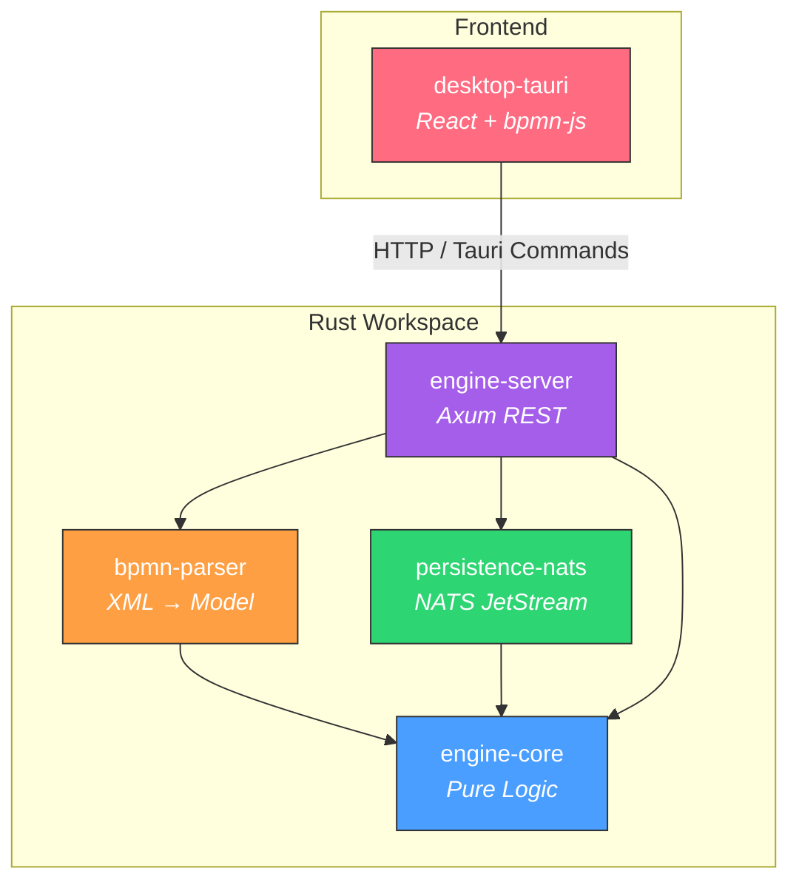
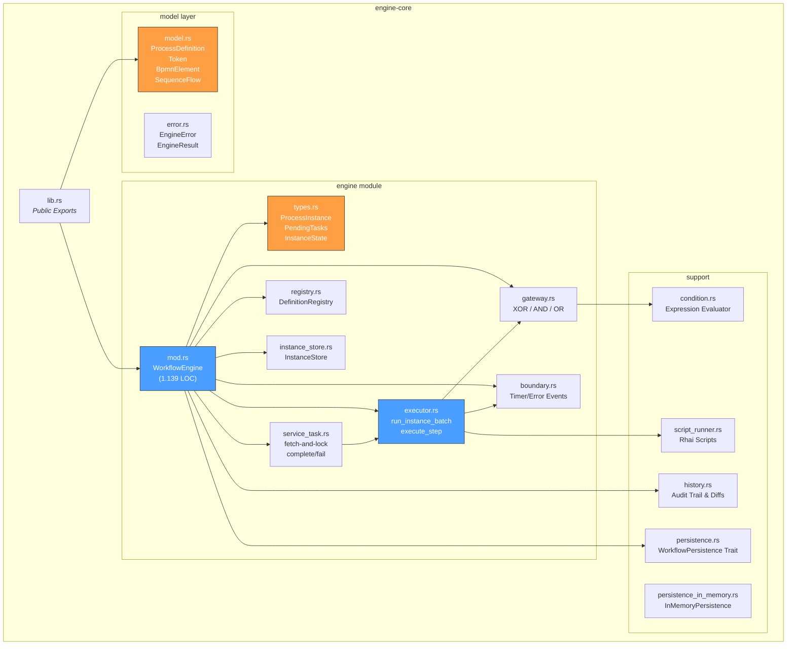
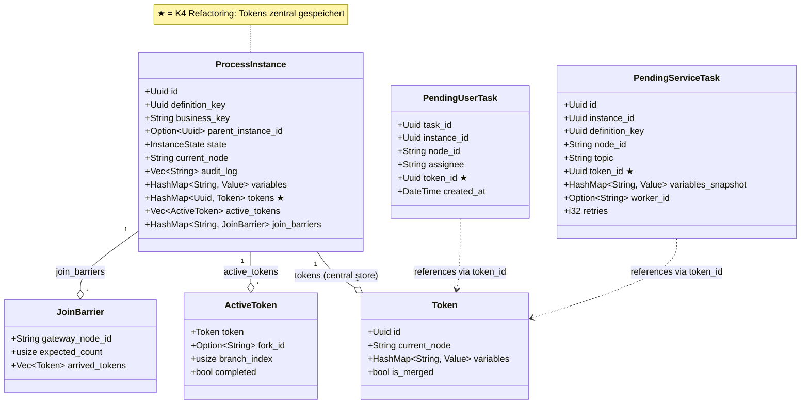
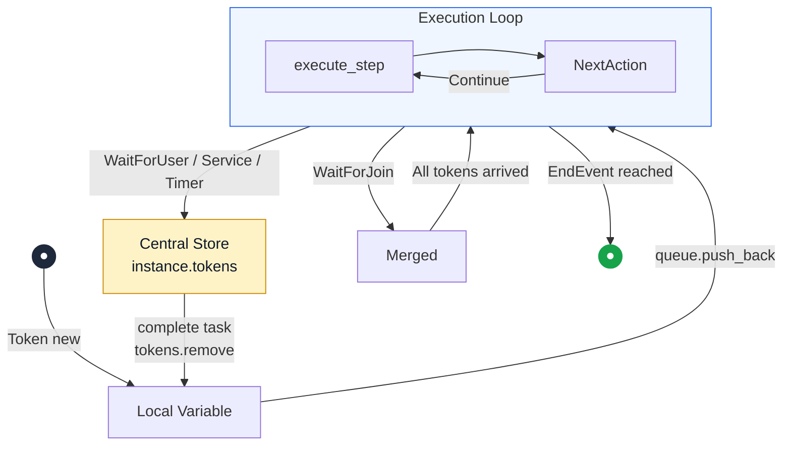
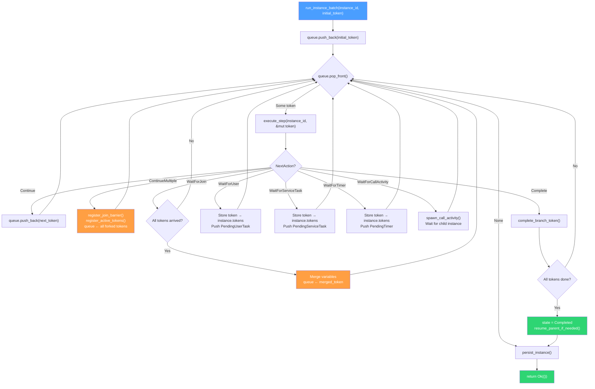
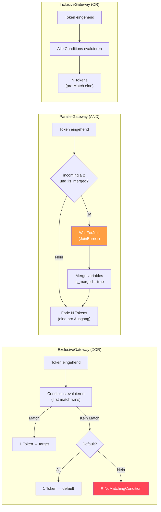
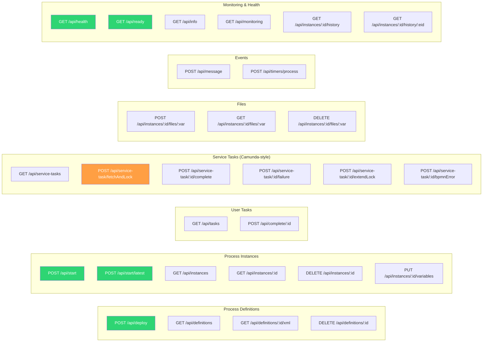
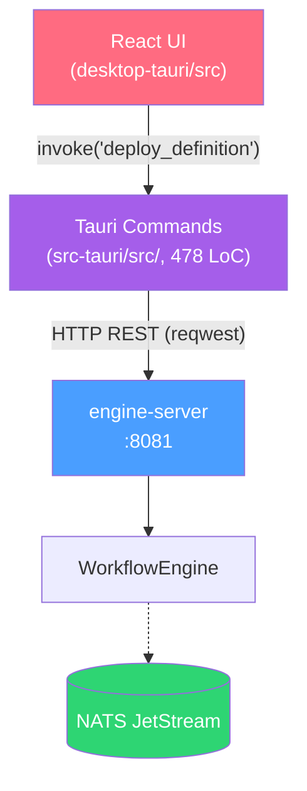

# bpmninja — Architektur-Dokumentation

> BPMN 2.0 Workflow Engine in Rust, token-basierte Execution
> Stand: 2026-04-05

---

## 1. Workspace-Überblick

Das Projekt ist ein Cargo-Workspace mit 6 Crates, einer Tauri Desktop-App und einem API-Spec:

| Crate | Lib LoC | Test LoC | Zweck |
|---|---|---|---|
| **engine-core** | ~4.546 | ~2.276 | Reine State Machine, Token-Execution, Gateways, Scripting |
| **bpmn-parser** | ~579 | ~224 | BPMN 2.0 XML → `ProcessDefinition` (quick-xml + serde) |
| **persistence-nats** | ~705 | ~89 | `WorkflowPersistence` via NATS JetStream KV/ObjectStore |
| **engine-server** | ~1.051 | ~1.232 | Axum REST API (HTTP-Adapter) + Background Timer Scheduler |
| **desktop-tauri** | ~4.036 (TS) + ~478 (Rust) | — | Tauri + React + TailwindCSS + bpmn-js Modeler (Thin Client) |
| **agent-orchestrator** | stub | — | External Worker Orchestrierung (geplant) |

### Workspace Dependency Graph



---

## 2. engine-core — Kernarchitektur

### 2.1 Modul-Struktur



### 2.2 WorkflowEngine — Komponentenaufteilung (K2)

Die Engine ist in fokussierte Komponenten aufgeteilt:

```rust
pub struct WorkflowEngine {
    // K2: Komponenten statt God-Object
    pub(crate) definitions:             DefinitionRegistry,                  // Immutable definition store
    pub(crate) instances:               InstanceStore,                       // Per-instance locking (K1)
    
    // Wait-State Queues (DashMap for lock-free sharding/concurrency)
    pub(crate) pending_user_tasks:      Arc<DashMap<Uuid, PendingUserTask>>,
    pub(crate) pending_service_tasks:   Arc<DashMap<Uuid, PendingServiceTask>>,
    pub(crate) pending_timers:          Arc<DashMap<Uuid, PendingTimer>>,
    pub(crate) pending_message_catches: Arc<DashMap<Uuid, PendingMessageCatch>>,
    
    // Infrastructure
    pub(crate) persistence:             Option<Arc<dyn WorkflowPersistence>>,
    pub(crate) persistence_error_count: AtomicU64,
    pub(crate) retry_tx:                Option<retry_queue::RetryQueueTx>,
}
```

| Komponente | Struct | Locking-Strategie |
|---|---|---|
| **DefinitionRegistry** | `Arc<RwLock<HashMap<Uuid, Arc<ProcessDefinition>>>>` | Shared, immutable nach Deploy |
| **InstanceStore** | `Arc<RwLock<HashMap<Uuid, Arc<RwLock<ProcessInstance>>>>>` | Per-Instance fine-grained (K1) |
| **PendingTask-Queues** | `Arc<DashMap<Uuid, Pending*>>` | Lock-free Sharding, concurrent O(1) ops |

---

## 3. Datenmodell

### 3.1 ProcessInstance (nach K4-Refactoring)



### 3.2 BPMN-Elementtypen

```rust
pub enum BpmnElement {
    StartEvent,
    TimerStartEvent(Duration),
    MessageStartEvent { message_name: String },
    EndEvent,
    ErrorEndEvent { error_code: String },
    UserTask(String),                               // assignee
    ServiceTask { topic: String },                  // Camunda-style
    ExclusiveGateway { default: Option<String> },   // XOR
    InclusiveGateway,                               // OR
    ParallelGateway,                                // AND
    TimerCatchEvent(Duration),
    BoundaryTimerEvent { attached_to, duration, cancel_activity },
    BoundaryErrorEvent { attached_to, error_code },
    MessageCatchEvent { message_name: String },
    CallActivity { called_element: String },
}
```

---

## 4. Execution-Architektur

### 4.1 Token-Lebenszyklus (K4)

Tokens existieren an **genau einer Stelle** zu jedem Zeitpunkt:



> **Central Store**: `instance.tokens: HashMap<Uuid, Token>` — PendingTasks halten nur `token_id: Uuid`.

### 4.2 Execution Loop (run_instance_batch)



### 4.3 Gateway-Routing



---

## 5. Persistence-Architektur

### 5.1 WorkflowPersistence Trait

```rust
#[async_trait]
pub trait WorkflowPersistence: Send + Sync {
    // Instance & Definition CRUD
    async fn save_instance(&self, instance: &ProcessInstance) -> EngineResult<()>;
    async fn list_instances(&self)                             -> EngineResult<Vec<ProcessInstance>>;
    async fn delete_instance(&self, id: &str)                  -> EngineResult<()>;
    async fn save_definition(&self, def: &ProcessDefinition)   -> EngineResult<()>;
    async fn list_definitions(&self)                           -> EngineResult<Vec<ProcessDefinition>>;
    
    // Task Queues
    async fn save_user_task(&self, task: &PendingUserTask)           -> EngineResult<()>;
    async fn save_service_task(&self, task: &PendingServiceTask)     -> EngineResult<()>;
    async fn save_timer(&self, timer: &PendingTimer)                 -> EngineResult<()>;
    async fn save_message_catch(&self, catch: &PendingMessageCatch) -> EngineResult<()>;
    
    // File Storage (Object Store)
    async fn save_file(&self, key: &str, data: &[u8])  -> EngineResult<()>;
    async fn load_file(&self, key: &str)                -> EngineResult<Vec<u8>>;
    
    // BPMN XML Storage
    async fn save_bpmn_xml(&self, key: &str, xml: &str) -> EngineResult<()>;
    async fn load_bpmn_xml(&self, key: &str)             -> EngineResult<String>;
    
    // History
    async fn append_history_entry(&self, entry: &HistoryEntry) -> EngineResult<()>;
    async fn query_history(&self, query: HistoryQuery)         -> EngineResult<Vec<HistoryEntry>>;
    
    // Monitoring
    async fn get_storage_info(&self) -> EngineResult<Option<StorageInfo>>;
}
```

### 5.2 Implementierungen

| Backend | Crate | Storage |
|---|---|---|
| `InMemoryPersistence` | `engine-core` | `HashMap` + `Vec` (Tests & Dev) |
| `NatsPersistence` | `persistence-nats` | NATS JetStream KV + ObjectStore |

**NATS KV-Stores:**
| KV-Bucket | Inhalt | Key-Format |
|---|---|---|
| `bpm_definitions` | `ProcessDefinition` (JSON) | `def-{uuid}` |
| `bpm_instances` | `ProcessInstance` (JSON) | `inst-{uuid}` |
| `bpm_user_tasks` | `PendingUserTask` (JSON) | `ut-{uuid}` |
| `bpm_service_tasks` | `PendingServiceTask` (JSON) | `st-{uuid}` |
| `bpm_timers` | `PendingTimer` (JSON) | `tmr-{uuid}` |
| `bpm_msg_catches` | `PendingMessageCatch` (JSON) | `msg-{uuid}` |
| `bpm_tokens` | `Token` (JSON) | `tok-{uuid}` |
| `bpm_bpmn_xml` | BPMN 2.0 XML (String) | `xml-{uuid}` |
| `bpm_history` | `HistoryEntry` (JSON) | `hist-{uuid}` |
| **ObjectStore** `instance_files` | Binärdateien | `file:{instance}-{var}-{filename}` |

### 5.3 Fault-Tolerant Retry Queue (K6)

Da NATS Ausfälle haben kann, verwendet die Engine einen zweistufigen Retry-Mechanismus für zustandsbehaltende I/O-Operationen:
1. **Inline-Retry**: Kurzes Backoff (z.B. 50ms) beim direkten Aufruf. Bei Erfolg geht es sofort weiter.
2. **Background Retry Queue**: Schlägt der Inline-Retry fehl (z.B. NATS ist offline), wird ein `RetryJob` an einen asynchronen Background-Worker übermittelt. Dieser Worker liest mit *exponentiellem Backoff* asynchron aus dem In-Memory-State den aktuellsten Stand aus und speist in NATS ein, sobald das System wieder online ist.
Dadurch entsteht kein State-Verlust nach einem transienten Netzwerkfehler.

---

## 6. REST API (engine-server)

> Vollständige OpenAPI 3.0 Spezifikation: **[docs/openapi.yaml](openapi.yaml)**

### 6.1 Route-Übersicht (30 Endpoints)



### 6.2 Server-Architektur

```rust
struct AppState {
    pub(crate) engine:       Arc<WorkflowEngine>,                           // Global shared instance (no RwLock needed!)
    pub(crate) persistence:  Option<Arc<dyn WorkflowPersistence>>,          // Optional NATS backend
    pub(crate) deployed_xml: Arc<RwLock<HashMap<String, String>>>,          // XML cache (key → XML)
    pub(crate) nats_url:     String,                                        // For /api/info endpoint
}
```

> Der Server teilt die Engine lediglich über `Arc<WorkflowEngine>`. Da alle inneren Collections (`DashMap`, `RwLock<HashMap>`) Thread-Safe sind und Mutationen über `&self` ablaufen, gibt es keinen monolithischen Read/Write-Lock mehr für die gesamte Engine. Dies eliminiert Contention bei hohem HTTP-Traffic. Instanzen sind über **K1 (Per-Instance-Locking)** via `InstanceStore` isoliert.

### 6.3 Background Timer Scheduler

Der Server startet einen Tokio-Background-Task, der periodisch `engine.process_timers()` aufruft:

```rust
// main.rs — automatisches Timer-Polling
let timer_interval_ms: u64 = env::var("TIMER_INTERVAL_MS")
    .ok().and_then(|v| v.parse().ok()).unwrap_or(1000);

tokio::spawn(async move {
    loop {
        tokio::time::sleep(Duration::from_millis(timer_interval_ms)).await;
        let mut engine = timer_engine.write().await;
        engine.process_timers().await;
    }
});
```

> **Konfiguration**: `TIMER_INTERVAL_MS` (Default: 1000ms). Kein externer Cron nötig.

### 6.4 Health & Readiness

| Endpoint | Funktion | Prüfung |
|----------|----------|---------|
| `GET /api/health` | Liveness Probe | Immer `200 OK` wenn Server läuft |
| `GET /api/ready` | Readiness Probe | Prüft NATS-Verbindung, `503` wenn disconnected |

---

## 7. Desktop-App (Tauri)

### 7.1 Frontend-Komponenten

| Datei | LoC | Zweck |
|---|---|---|
| `App.tsx` | 169 | Main Layout, Tab-Navigation (6 Tabs) |
| `Modeler.tsx` | 311 | bpmn-js Modeler mit Deploy, Start & Variable-Dialog |
| `Instances.tsx` | 518 | Instanz-Liste (grouped by Definition), Detail-Overlay |
| `InstanceViewer.tsx` | 108 | Read-only BPMN-Viewer mit aktiver Node-Markierung |
| `HistoryTimeline.tsx` | 225 | Event-Tabelle mit Filtern, Detail-Dialog, Diff-Anzeige |
| `DeployedProcesses.tsx` | 299 | Versions-Gruppierung, Accordion, Cascade Delete |
| `VariableEditor.tsx` | 479 | Typed Editor (6 Typen inkl. File), Upload/Download |
| `Monitoring.tsx` | 239 | 8 Metric Cards, NATS Storage Breakdown, Auto-Refresh (5s) |
| `PendingTasks.tsx` | 286 | User & Service Task Listen mit Completion-Dialogen |
| `Settings.tsx` | 161 | API URL Config + Connection Verify |
| `ErrorBoundary.tsx` | 72 | React Error Boundary |
| `MessageDialog.tsx` | 93 | Message-Korrelations-Dialog |
| `IncidentsView.tsx` | 120 | Incident-List (Persistence Errors) |
| `lib/tauri.ts` | 240 | Alle Tauri Command Wrappers (typisierte API-Schicht) |
| Custom Properties | ~337 | Condition, Script, Topic Extensions für bpmn-js |
| `index.css` | 161 | TailwindCSS + HSL Design-Token-Variablen |

### 7.2 Thin-Client Architektur

Die Desktop-App operiert als **Thin Client** — alle Workflow-Logik liegt im `engine-server`.



> **Konfiguration**: `ENGINE_API_URL` Environment-Variable (Default: `http://localhost:8081`).

---

## 8. Concurrency & Locking (K1)

### 8.1 Lock-Hierarchie

```
WorkflowEngine (Arc)
├── DefinitionRegistry       → Arc<RwLock<HashMap>>          (1 globaler Lock)
├── InstanceStore             → Arc<RwLock<HashMap>>          (1 globaler Lock für Map)
│   └── ProcessInstance[i]   → Arc<RwLock<ProcessInstance>>  (per-Instance Lock!)
├── pending_user_tasks       → Arc<DashMap>                  (lock-free / sharded)
├── pending_service_tasks    → Arc<DashMap>                  (lock-free / sharded)
├── pending_timers           → Arc<DashMap>                  (lock-free / sharded)
└── pending_message_catches  → Arc<DashMap>                  (lock-free / sharded)
```

### 8.2 Deadlock-Prevention Pattern

```rust
// ❌ VERBOTEN: Lock über .await halten
let inst = instance_arc.write().await;
self.some_async_method().await;  // DEADLOCK!

// ✅ KORREKT: Lock scoped vor .await
{
    let mut inst = instance_arc.write().await;
    inst.state = InstanceState::Running;
}  // Lock dropped
self.some_async_method().await;  // Safe!
```

---

## 9. History & Audit Trail

Jeder State-Übergang wird als `HistoryEntry` gespeichert:

| Feld | Typ | Beschreibung |
|---|---|---|
| `event_type` | `HistoryEventType` | InstanceStarted, TaskCompleted, TokenForked, ... |
| `diff` | `Option<HistoryDiff>` | Automatisch berechneter Diff (variables, status, node) |
| `actor_type` | `ActorType` | Engine, User, ServiceWorker, Timer, Listener |
| `full_state_snapshot` | `Option<Value>` | Snapshot alle 8 Audit-Einträge |

**Diff-Berechnung:** `calculate_diff(old: &ProcessInstance, new: &ProcessInstance) → HistoryDiff`
- Variable-Diff: added, removed, changed (mit Wert-Truncation >1KB)
- Status-Diff: "Running → Completed"
- Node-Diff: "task1 → end"
- File-Upload-Erkennung: "File 'report.pdf' uploaded (1.2 MB)"

---

## 10. Code-Statistiken

> Stand: 04.04.2026 — gemessen via `wc -l` und `cargo test --workspace`

| Bereich | Dateien | LOC |
|---|---|---|
| engine-core (lib) | 17 | 4.750 |
| engine-core (tests) | 2 | 2.400 |
| bpmn-parser | 4 | 803 |
| persistence-nats | 5 | 794 |
| engine-server (lib + main) | 3 | 1.051 |
| engine-server (E2E tests) | 12 | 1.800 |
| **Rust Workspace Gesamt** | **43** | **~11.600** |
| desktop-tauri (TypeScript + CSS) | 22 | 4.036 |
| desktop-tauri (Rust Backend) | 8 | 478 |
| **Projekt Gesamt** | **~73** | **~16.100** |

### Test-Übersicht (136 Tests, alle ✅)

| Crate | Unit | E2E | Gesamt |
|---|---|---|---|
| engine-core | 92 | — | 92 |
| bpmn-parser | 6 | — | 6 |
| persistence-nats | 2 | — | 2 |
| engine-server | — | 36 | 36 |
| **Gesamt** | **100** | **36** | **136** |
