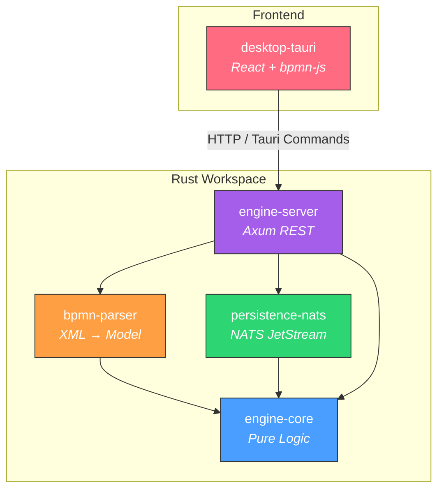
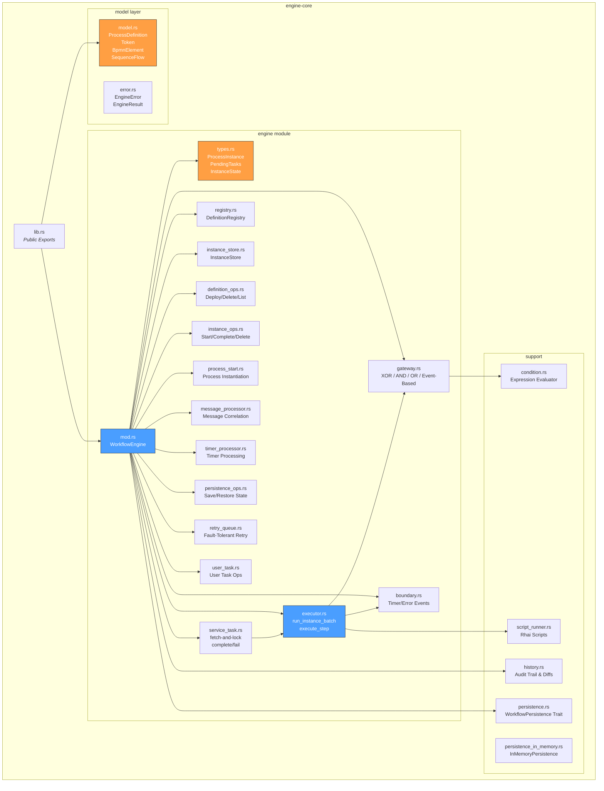
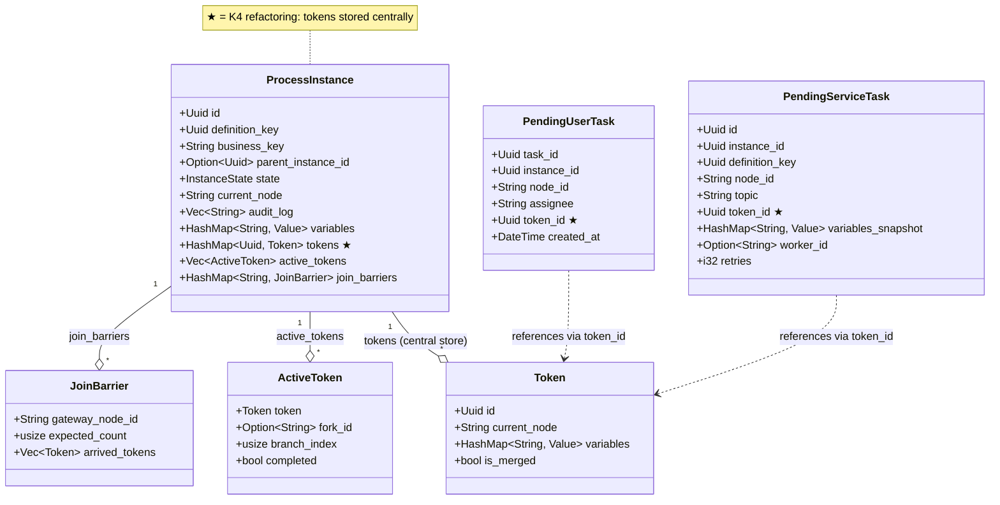
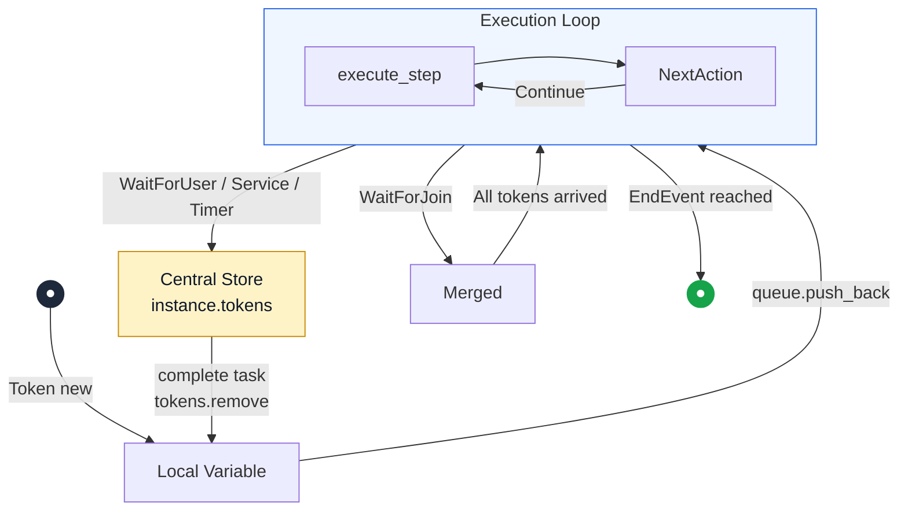
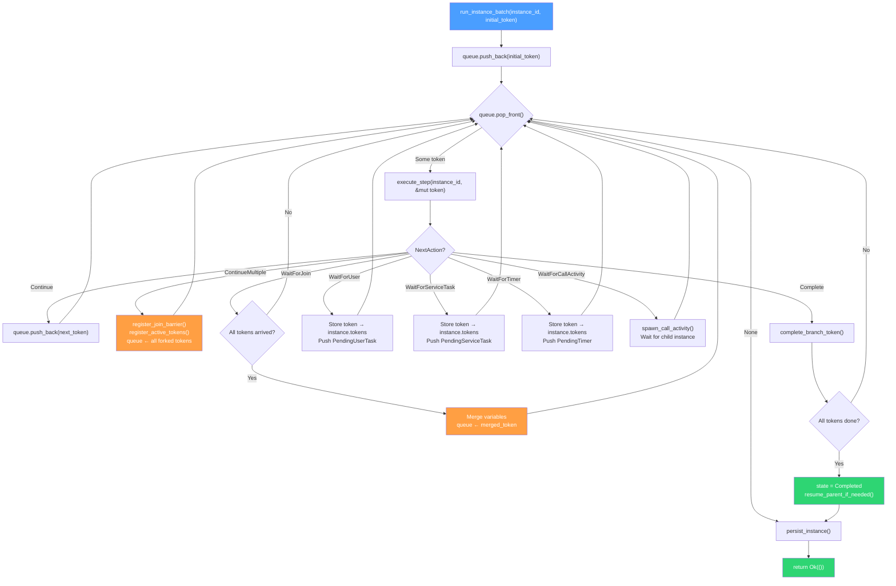
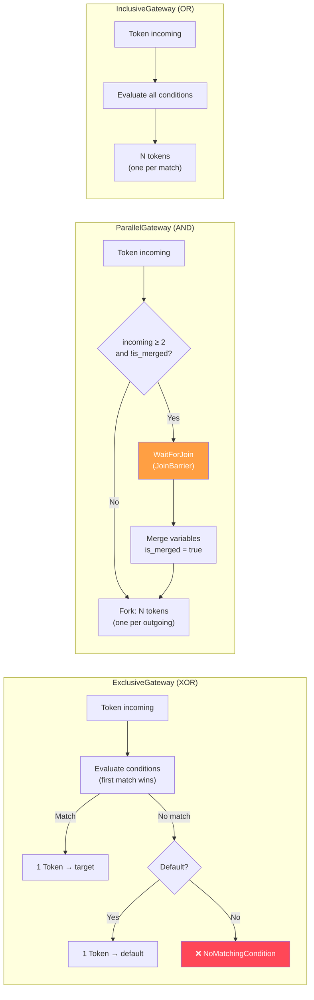
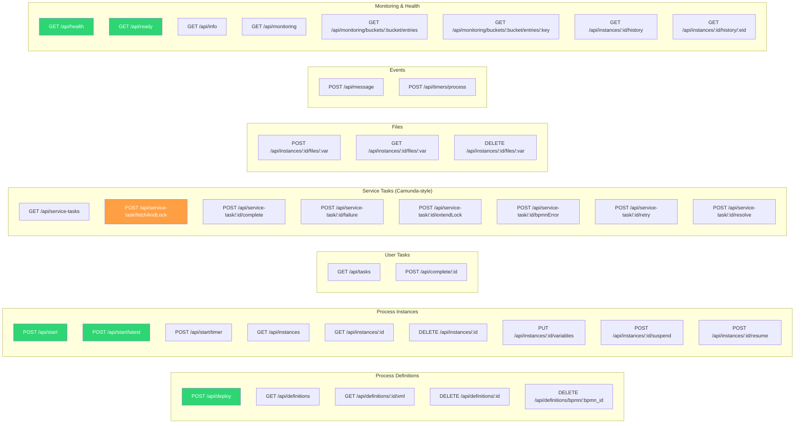

# bpmninja — Architecture Documentation

> BPMN 2.0 workflow engine in Rust, token-based execution
> As of: 2026-04-10

---

## 1. Workspace Overview

The project is a Cargo workspace with 6 crates, a Tauri desktop app and an API spec:

| Crate | Lib LoC | Test LoC | Purpose |
|---|---|---|---|
| **engine-core** | ~7,191 | ~3,545 | Pure state machine, token execution, gateways, scripting |
| **bpmn-parser** | ~1,963 | (inline) | BPMN 2.0 XML → `ProcessDefinition` (quick-xml + serde) |
| **persistence-nats** | ~1,149 | (inline) | `WorkflowPersistence` via NATS JetStream KV/ObjectStore |
| **engine-server** | ~1,280 | ~1,934 | Axum REST API (HTTP adapter) + background timer scheduler |
| **desktop-tauri** | ~5,186 (TS) + ~623 (Rust) | — | Tauri + React + TailwindCSS + bpmn-js modeler (thin client) |
| **agent-orchestrator** | stub | — | External worker orchestration (planned) |

### Workspace Dependency Graph



---

## 2. engine-core — Core Architecture

### 2.1 Module Structure



### 2.2 WorkflowEngine — Component Breakdown (K2)

The engine is split into focused components:

```rust
pub struct WorkflowEngine {
    // K2: components instead of a god object
    pub(crate) definitions:             DefinitionRegistry,                  // Immutable definition store
    pub(crate) instances:               InstanceStore,                       // Per-instance locking (K1)
    
    // Wait-State Queues (DashMap for lock-free sharding/concurrency)
    pub(crate) pending_user_tasks:      Arc<DashMap<Uuid, PendingUserTask>>,
    pub(crate) pending_service_tasks:   Arc<DashMap<Uuid, PendingServiceTask>>,
    pub(crate) pending_timers:          Arc<DashMap<Uuid, PendingTimer>>,
    pub(crate) pending_message_catches: Arc<DashMap<Uuid, PendingMessageCatch>>,
    
    // Infrastructure
    pub(crate) persistence:             Option<Arc<dyn WorkflowPersistence>>,
    pub(crate) persistence_error_count: AtomicU64,
    pub(crate) retry_tx:                Option<retry_queue::RetryQueueTx>,
}
```

| Component | Struct | Locking Strategy |
|---|---|---|
| **DefinitionRegistry** | `Arc<RwLock<HashMap<Uuid, Arc<ProcessDefinition>>>>` | Shared, immutable after deploy |
| **InstanceStore** | `Arc<RwLock<HashMap<Uuid, Arc<RwLock<ProcessInstance>>>>>` | Per-instance fine-grained (K1) |
| **PendingTask queues** | `Arc<DashMap<Uuid, Pending*>>` | Lock-free sharding, concurrent O(1) ops |

---

## 3. Data Model

### 3.1 ProcessInstance (after K4 refactoring)



### 3.2 BPMN Element Types

```rust
pub enum BpmnElement {
    StartEvent,
    TimerStartEvent(TimerDefinition),              // Duration | AbsoluteDate | CronCycle | RepeatingInterval
    MessageStartEvent { message_name: String },
    EndEvent,
    TerminateEndEvent,
    ErrorEndEvent { error_code: String },
    UserTask(String),                               // assignee
    ServiceTask { topic: String, multi_instance: Option<MultiInstanceDef> },
    ScriptTask { script: String, multi_instance: Option<MultiInstanceDef> },
    SendTask { message_name: String, multi_instance: Option<MultiInstanceDef> },
    ExclusiveGateway { default: Option<String> },   // XOR
    InclusiveGateway,                               // OR
    ParallelGateway,                                // AND
    EventBasedGateway,                              // waits for first catch event
    TimerCatchEvent(TimerDefinition),
    BoundaryTimerEvent { attached_to, timer: TimerDefinition, cancel_activity },
    BoundaryMessageEvent { attached_to, message_name, cancel_activity },
    BoundaryErrorEvent { attached_to, error_code: Option<String> },
    MessageCatchEvent { message_name: String },
    CallActivity { called_element: String },
    EmbeddedSubProcess { start_node_id: String },   // embedded sub-process (flattened)
    SubProcessEndEvent { sub_process_id: String },  // synthetic end event
}
```

---

## 4. Execution Architecture

### 4.1 Token Lifecycle (K4)

Tokens exist in **exactly one place** at any moment in time:



> **Central store**: `instance.tokens: HashMap<Uuid, Token>` — pending tasks only hold `token_id: Uuid`.

### 4.2 Execution Loop (run_instance_batch)



### 4.3 Gateway Routing



---

## 5. Persistence Architecture

### 5.1 WorkflowPersistence Trait

```rust
#[async_trait]
pub trait WorkflowPersistence: Send + Sync {
    // Instance & Definition CRUD
    async fn save_instance(&self, instance: &ProcessInstance) -> EngineResult<()>;
    async fn list_instances(&self)                             -> EngineResult<Vec<ProcessInstance>>;
    async fn delete_instance(&self, id: &str)                  -> EngineResult<()>;
    async fn save_definition(&self, def: &ProcessDefinition)   -> EngineResult<()>;
    async fn list_definitions(&self)                           -> EngineResult<Vec<ProcessDefinition>>;
    
    // Task Queues
    async fn save_user_task(&self, task: &PendingUserTask)           -> EngineResult<()>;
    async fn save_service_task(&self, task: &PendingServiceTask)     -> EngineResult<()>;
    async fn save_timer(&self, timer: &PendingTimer)                 -> EngineResult<()>;
    async fn save_message_catch(&self, catch: &PendingMessageCatch) -> EngineResult<()>;
    
    // File Storage (Object Store)
    async fn save_file(&self, key: &str, data: &[u8])  -> EngineResult<()>;
    async fn load_file(&self, key: &str)                -> EngineResult<Vec<u8>>;
    
    // BPMN XML Storage
    async fn save_bpmn_xml(&self, key: &str, xml: &str) -> EngineResult<()>;
    async fn load_bpmn_xml(&self, key: &str)             -> EngineResult<String>;
    
    // History
    async fn append_history_entry(&self, entry: &HistoryEntry) -> EngineResult<()>;
    async fn query_history(&self, query: HistoryQuery)         -> EngineResult<Vec<HistoryEntry>>;
    
    // Monitoring
    async fn get_storage_info(&self) -> EngineResult<Option<StorageInfo>>;
}
```

### 5.2 Implementations

| Backend | Crate | Storage |
|---|---|---|
| `InMemoryPersistence` | `persistence-memory` | `HashMap` + `Vec` (tests & dev) |
| `NatsPersistence` | `persistence-nats` | NATS JetStream KV + ObjectStore |

**NATS KV stores:**
| KV bucket | Contents | Key format |
|---|---|---|
| `bpm_definitions` | `ProcessDefinition` (JSON) | `def-{uuid}` |
| `bpm_instances` | `ProcessInstance` (JSON) | `inst-{uuid}` |
| `bpm_user_tasks` | `PendingUserTask` (JSON) | `ut-{uuid}` |
| `bpm_service_tasks` | `PendingServiceTask` (JSON) | `st-{uuid}` |
| `bpm_timers` | `PendingTimer` (JSON) | `tmr-{uuid}` |
| `bpm_msg_catches` | `PendingMessageCatch` (JSON) | `msg-{uuid}` |
| `bpm_tokens` | `Token` (JSON) | `tok-{uuid}` |
| `bpm_bpmn_xml` | BPMN 2.0 XML (string) | `xml-{uuid}` |
| `bpm_history` | `HistoryEntry` (JSON) | `hist-{uuid}` |
| **ObjectStore** `instance_files` | Binary files | `file:{instance}-{var}-{filename}` |

### 5.3 Fault-Tolerant Retry Queue (K6)

Since NATS can experience outages, the engine uses a two-stage retry mechanism for stateful I/O operations:
1. **Inline retry**: short backoff (e.g. 50ms) on the direct call. On success, execution continues immediately.
2. **Background retry queue**: if the inline retry fails (e.g. NATS is offline), a `RetryJob` is dispatched to an asynchronous background worker. That worker reads the most recent state from the in-memory state with *exponential backoff* and feeds it into NATS as soon as the system is back online.
This prevents state loss after a transient network failure.

---

## 6. REST API (engine-server)

> Complete OpenAPI 3.0 specification: **[docs/openapi.yaml](openapi.yaml)**

### 6.1 Route Overview (38 endpoints)



### 6.2 Server Architecture

```rust
struct AppState {
    pub(crate) engine:       Arc<WorkflowEngine>,                           // Global shared instance (no RwLock needed!)
    pub(crate) persistence:  Option<Arc<dyn WorkflowPersistence>>,          // Optional NATS backend
    pub(crate) deployed_xml: Arc<RwLock<HashMap<String, String>>>,          // XML cache (key → XML)
    pub(crate) nats_url:     String,                                        // For /api/info endpoint
}
```

> The server shares the engine only via `Arc<WorkflowEngine>`. Because all inner collections (`DashMap`, `RwLock<HashMap>`) are thread-safe and mutations go through `&self`, there is no longer a monolithic read/write lock over the entire engine. This eliminates contention under heavy HTTP traffic. Instances are isolated via **K1 (per-instance locking)** through `InstanceStore`.

### 6.3 Background Timer Scheduler

The server spawns a Tokio background task that periodically calls `engine.process_timers()`:

```rust
// main.rs — automatic timer polling (lock-free via Arc<WorkflowEngine>)
let timer_interval_ms: u64 = env::var("TIMER_INTERVAL_MS")
    .ok().and_then(|v| v.parse().ok()).unwrap_or(1000);

tokio::spawn(async move {
    loop {
        tokio::time::sleep(Duration::from_millis(timer_interval_ms)).await;
        match timer_engine.process_timers().await {
            Ok(n) => tracing::info!("Timer scheduler: processed {} expired timer(s)", n),
            Err(e) => tracing::warn!("Timer scheduler error: {}", e),
        }
    }
});
```

> **Configuration**: `TIMER_INTERVAL_MS` (default: 1000ms). No external cron required.

### 6.4 Health & Readiness

| Endpoint | Function | Check |
|----------|----------|-------|
| `GET /api/health` | Liveness probe | Always `200 OK` when the server is running |
| `GET /api/ready` | Readiness probe | Checks NATS connection, `503` when disconnected |

---

## 7. Desktop App (Tauri)

### 7.1 Frontend Components

| File | LoC | Purpose |
|---|---|---|
| `App.tsx` | ~180 | Main layout, tab navigation (7 tabs), timer-start detection |
| `ModelerPage.tsx` | ~350 | bpmn-js modeler with deploy, start & variable dialog |
| `InstancesPage.tsx` | ~245 | Instance list (grouped by definition), suspend icon |
| `InstanceDetailDialog.tsx` | ~345 | Instance details with suspend/resume button, timer cycle banner, auto-refresh |
| `InstanceViewer.tsx` | ~125 | Read-only BPMN viewer with active node highlighting + timer pulse |
| `HistoryTimeline.tsx` | ~225 | Event table with filters, detail dialog, diff display |
| `DeployedProcessesPage.tsx` | ~330 | Version grouping, accordion, cascade delete |
| `VariableEditor.tsx` | ~480 | Typed editor (6 types including file), upload/download |
| `MonitoringPage.tsx` | ~365 | Metric cards, NATS storage breakdown, KV browser, auto-refresh |
| `PendingTasksPage.tsx` | ~290 | User & service task lists with completion dialogs |
| `IncidentsPage.tsx` | ~165 | Incident cards with quick retry, detail link, auto-refresh |
| `IncidentDetailDialog.tsx` | ~160 | Retry (configurable retries) + resolve (with VariableEditor) |
| `SettingsPage.tsx` | ~165 | API URL config + connection verify |
| `ErrorBoundary.tsx` | ~72 | React error boundary |
| `MessageDialog.tsx` | ~93 | Message correlation dialog |
| `lib/tauri.ts` | ~170 | All Tauri command wrappers (typed API layer) |
| Custom Properties | ~290 | Condition, script, topic extensions for bpmn-js |
| `index.css` | ~165 | TailwindCSS + HSL design token variables |

### 7.2 Thin-Client Architecture

The desktop app operates as a **thin client** — all workflow logic lives in `engine-server`.


> **Configuration**: `ENGINE_API_URL` environment variable (default: `http://localhost:8081`).

---

## 8. Concurrency & Locking (K1)

### 8.1 Lock Hierarchy

```
WorkflowEngine (Arc)
├── DefinitionRegistry       → Arc<RwLock<HashMap>>          (1 global lock)
├── InstanceStore             → Arc<RwLock<HashMap>>          (1 global lock for the map)
│   └── ProcessInstance[i]   → Arc<RwLock<ProcessInstance>>  (per-instance lock!)
├── pending_user_tasks       → Arc<DashMap>                  (lock-free / sharded)
├── pending_service_tasks    → Arc<DashMap>                  (lock-free / sharded)
├── pending_timers           → Arc<DashMap>                  (lock-free / sharded)
└── pending_message_catches  → Arc<DashMap>                  (lock-free / sharded)
```

### 8.2 Deadlock Prevention Pattern

```rust
// ❌ FORBIDDEN: hold a lock across .await
let inst = instance_arc.write().await;
self.some_async_method().await;  // DEADLOCK!

// ✅ CORRECT: lock scoped before .await
{
    let mut inst = instance_arc.write().await;
    inst.state = InstanceState::Running;
}  // Lock dropped
self.some_async_method().await;  // Safe!
```

---

## 9. History & Audit Trail

Every state transition is stored as a `HistoryEntry`:

| Field | Type | Description |
|---|---|---|
| `event_type` | `HistoryEventType` | InstanceStarted, TaskCompleted, TokenForked, ... |
| `diff` | `Option<HistoryDiff>` | Automatically computed diff (variables, status, node) |
| `actor_type` | `ActorType` | Engine, User, ServiceWorker, Timer, Listener |
| `full_state_snapshot` | `Option<Value>` | Snapshot every 8 audit entries |

**Diff calculation:** `calculate_diff(old: &ProcessInstance, new: &ProcessInstance) → HistoryDiff`
- Variable diff: added, removed, changed (with value truncation >1KB)
- Status diff: "Running → Completed"
- Node diff: "task1 → end"
- File upload detection: "File 'report.pdf' uploaded (1.2 MB)"

---

## 10. Code Statistics

> As of: 2026-04-06 — measured via `wc -l` and `cargo test --workspace`

| Area | Files | LOC |
|---|---|---|
| engine-core (lib) | 25 | 7,191 |
| engine-core (tests) | 2 | 3,545 |
| bpmn-parser | 4 | 1,963 |
| persistence-nats | 5 | 1,149 |
| engine-server (lib + main) | 12 | 1,280 |
| engine-server (E2E tests) | 12 | 1,934 |
| **Rust workspace total** | **60** | **~17,062** |
| desktop-tauri (TypeScript + CSS) | 38 | 5,186 |
| desktop-tauri (Rust backend) | 10 | 623 |
| **Project total** | **~108** | **~22,871** |

### Test Overview (167 tests, all ✅)

| Crate | Unit | E2E | Total |
|---|---|---|---|
| engine-core | 102 | — | 102 |
| bpmn-parser | 27 | — | 27 |
| persistence-nats | 2 | — | 2 |
| engine-server | — | 36 | 36 |
| **Total** | **131** | **36** | **167** |
